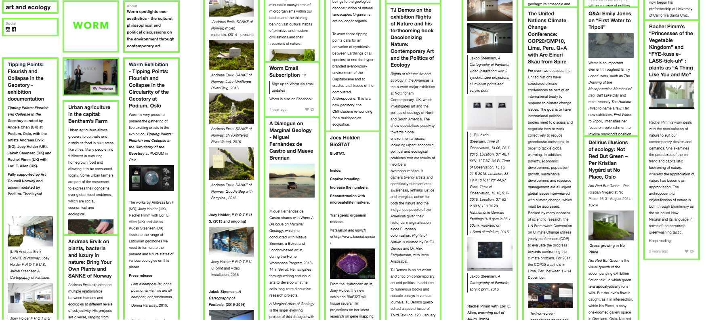

---
title: "Worm: art + ecology Begins as an Online Platform for Climate Arts"
description: "I independently produced a long-term curatorial project called Worm: art + ecology. It focused on communicating climate change issues through contemporary art and creative practices and began in late 2014 as an online blog that regularly published interviews with artists, researchers and activists."
date: 2014-10-01
tags: ['curation', 'workshop','talk']
image: './141001_wormbegins.png'
--- 

I independently produced a long-term curatorial project called Worm: art + ecology. It focused on communicating climate change issues through contemporary art and creative practices and began in late 2014 as an online blog that regularly published interviews with artists, researchers and activists. 

Through this, I curated online and gallery exhibitions, and delivered public workshops and talks focused on intersectional climate justice issues. 

Over 7 years, I produced 5 international exhibitions under the name Worm: art + ecology. I directly commissioned 53 artists worldwide for collaboration, by gaining and managing project funding from funders Arts Council England, Mondriaan Fund, Het Nieuwe Instituut, Gemeente Rotterdam, Stichting Bevordering van Volkskracht, MAMA, and Arts Council Norway. 

