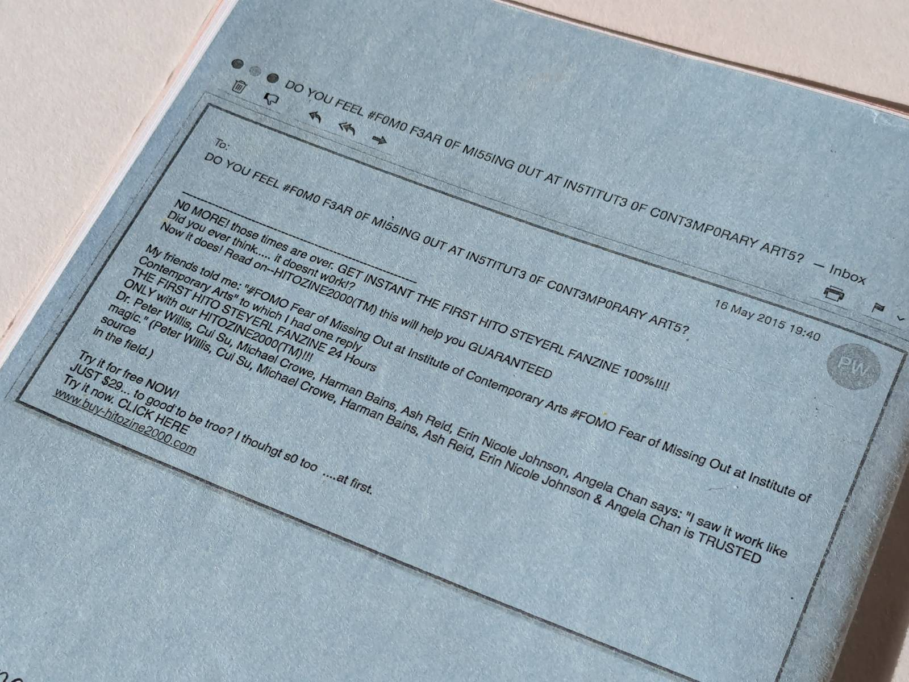

My collage illustration for the first issue of Hitozine, a fanzine about artist Hito Steyerl, was published in a zine that features articles inspired by Hito’s practice - started off as and still is a joke. It was created on the occasion of 'FOMO (Fear of Missing Out)', a three-day talks event at the Institute of Contemporary Arts, London from 29–31 May 2015. It 'features Hito's quotes, fashion, memes, tweets etc.' Contributors include Peter Willis, Cui Su, Michael Crowe, Harman Bains, Ash Reid, Erin Nicole Johnson, Angela YT Chan. Printed by Studio Operative.

Find out more at BOOKS in Peckham [here](https://www.books-peckham.com/shop#!/?search=hitozine) and see it catalogued [here](https://aaa.org.hk/en/collections/search/library/hitozine-the-worlds-1-hito-steyerl-fanzine/search/actors-id:195553/page/1)

