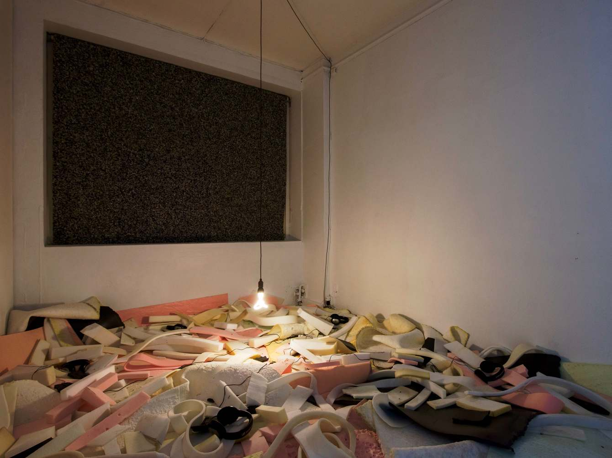
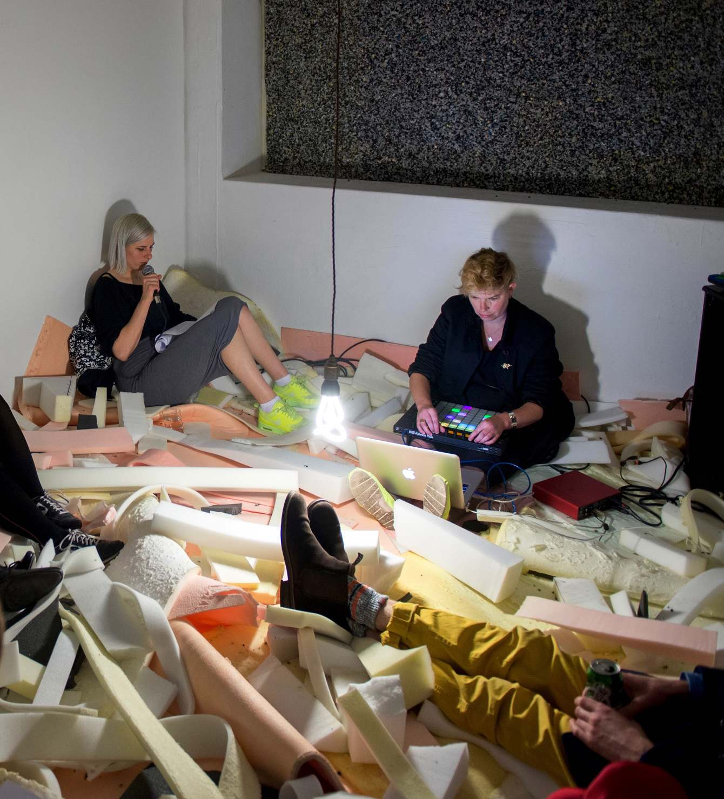

(April 22, 2016 → May 1, 2016)  In my first year of online activities as  Worm: art + ecology, I was invited by Podium in Oslo to guest curate my first international exhibition as part of the gallery's year-long focus on ecologies. Titled 'Tipping Points: Flourish and Collapse in the Circularity of the Geostory', it showed five international artists representing humankind’s micro- to macroscopic manipulations of nature that have accumulated to the ‘tipping points’ of climate change. Together with Rachel Pimm, Lori E. Allen, Joey Holder, Andreas Ervik and Jakob Kudsk Steensen, our exhibition opened on Earth Day 2016 with artist performances.

The project was fully funded by Kulturrådet (Arts Council Norway). 

--- 

# Project concept

The exhibition was titled 'Tipping Points: Flourish and Collapse in the Circularity of the Geostory' and showed five international artists representing humankind’s manipulation of nature that has accumulated to the ‘tipping points’ of climate change. The concept takes inspiration from Donna Haraway's line "I am a compost-ist, not a posthuman-ist: we are all compost, not posthuman" from her 2015 essay, 'Anthropocene, Capitalocene, Plantationocene, Chthulucene: Making Kin'. It questions, since nature has been changed by humans and capital through the industrialised production of natural elements and beings, where did the natural belong and where will it return/be displaced to in the future after these processes? 

From microscopic to macroscopic in scale; from the technological manipulation of the genes to the geological deconstruction of natural landscapes, the effects of the manipulations accumulate to the ‘tipping points’ of climate change. 

---

# Exhibited artists and artworks 

## Joey Holder, ‘N E M A T O D E’ (2015)

Holder’s ‘N E M A T O D E’ (2015) focused on the genetic models of sea creatures found inhabiting underwater volcanoes off the Norwegian coast. The work spread across the inner gallery walls as an enveloping wall print and a video work navigated the subaquatic environment with submarine research footage. 

## Rachel Pimm and Lori E. Allen, ‘worming out of skum’ (2016)

Pimm and Allen’s collaborative ‘worming out of skum’ (2016) was set in a room of recycled scrap foam and was an adaption of their Chisenhale Gallery London commission. This was illustrated with Allen’s metallic sound compositions of decay of organic and manmade landfills, with Pimm’s spoken narrative from the perspective of a worm. 

## Andreas Ervik, ‘SANKE of Norway: SANKE goodybag, elv, leire' (2014-2016)

Ervik roleplayed as the CEO of his luxury health brand, ‘SANKE of Norway’ (2014-present). His work emphasised and mocked the commodification of Norwegian natural elements and the exported ideology of Scandinavian nature as pure. Ervik installed his commodities in a 'shop display' on moss and other natural materials, which were relocated from his own backyard to the gallery.

## Jakob Kudsk Steensen, 'Fantasia of Cartography' (2016)

Steensen’s 'Fantasia of Cartography' was a multimedia installation of aluminium etchings of insects, a digital map print and a two channel floor to ceiling immersive video projection. The work considered the vast landscapes in a southern Spanish desert, which were altered by financial speculation, the economic crash, incomplete tourist resort builds and the blend of native and invasive species there.

---

# Opening event and performances

The exhibition opened to the public for two weeks from Earth Day 22nd April 2016 with performances from Andreas Ervik with a ‘SANKE of Norway brand talk’, complete with product demonstrations and sample giveaways, and a live rendition of ‘worming out of skum’ by Rachel Pimm and Lori E. Allen. 

Rachel Pimm and Lori E. Allen performing 'worming out of skum' on the opening evening 22/04/16

Andreas Ervik presenting 'SANKE of Norway' as its CEO on the opening evening 22/04/16

PODIUM is an artist-run space based in Oslo, find out more [here](https://podium.enterprises/portfolio/tipping-points-flourish-and-collapse-in-the-circularity-of-the-geostory/)
