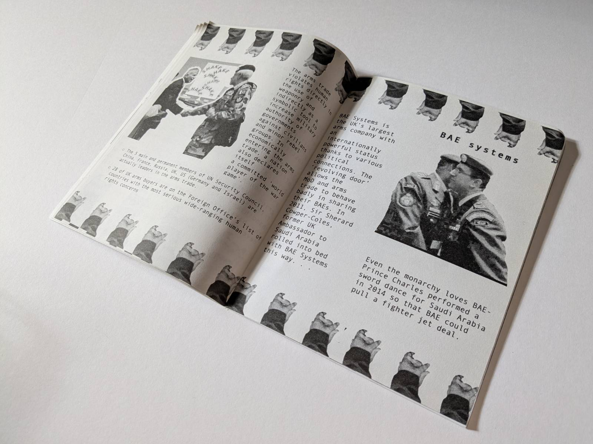

My illustration about BAE and handshakes for the second issue of Hitozine, a fanzine about artist Hito Steyerl, was published. The zine features articles inspired by Hito’s practice, started off as and still is a joke. Contributors include Angela YT Chan, Peter Willis, Marina Georgiou, Rosa Tyhurst, Cui Su, Emily Beber, Erin Nicole Johnson, Herb Shellenberger, Harman Bains, Kathryn Lloyd, Liam Gillick.

Find out more at BOOKS in Peckham [here](https://www.books-peckham.com/shop#!/?search=hitozine) and see it catalogued [here](https://aaa.org.hk/en/collections/search/library/hitozine-2-the-worlds-only-hito-steyerl-fanzine)

 