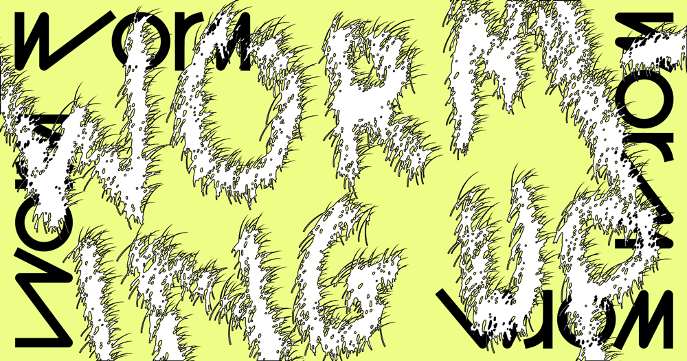

'Worming up!’ was a workshop I facilitated for creative practitioners interested in discussing and learning about the environ(mental) challenges we face in the broader context of art practice and production. Taking effective action points to confront ecological issues, how are they transferable to the attitudes we have towards sustaining creative practices? With activities situated in the concepts of Worm: art + ecology’s current project ‘Refuse:(v)(n)(-)’, the workshop explored how we can recognise toxicity in our systems of production, develop resilience and imagine empowered alternatives for an environment in which sustainable creative practices may flourish. 

Find out more about Two Queens [here](https://2queens.com/)

Image: Al Walker