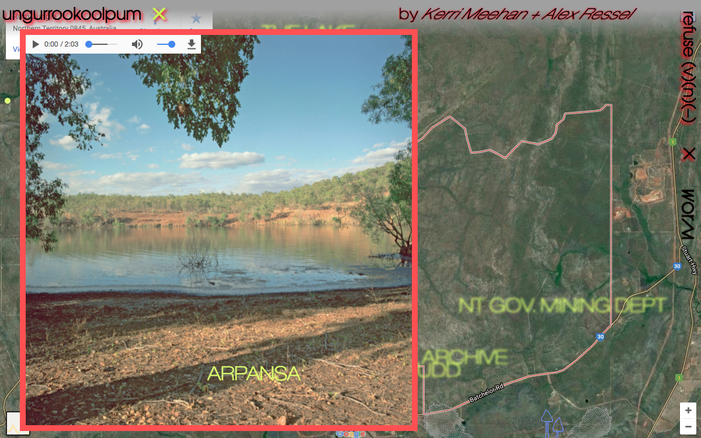
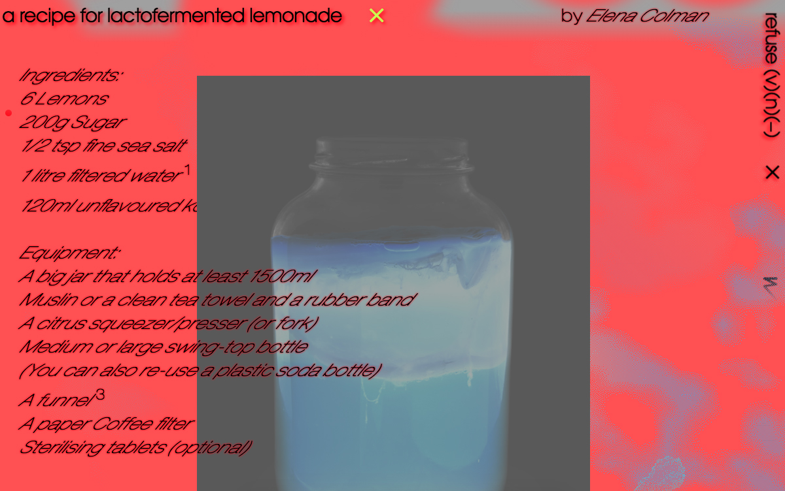
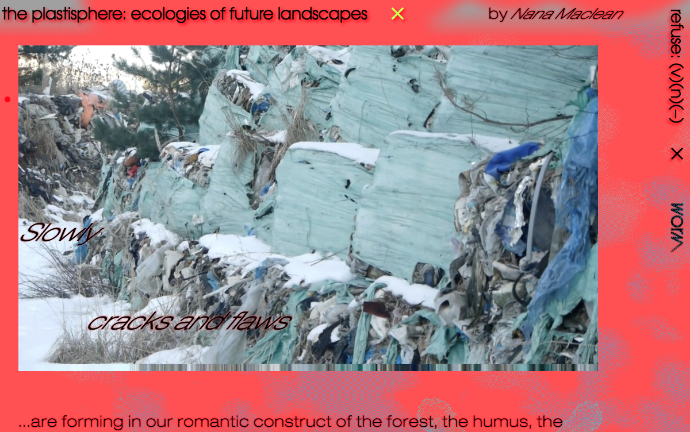
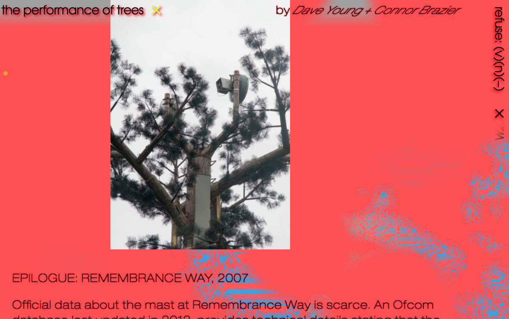
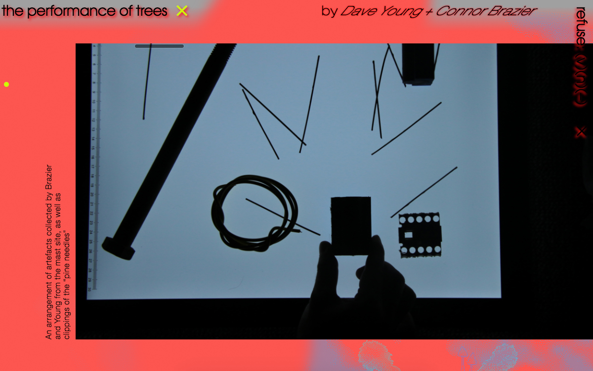

(January 1, 2018 → December 31, 2018) Throughout 2018, Refuse: (v)(n)(-) was an online exhibition of 16 artists in 13 projects covering a range of ecological issues. It was curated by Worm: art + ecology (aka Angela YT Chan) and designed by Alex Walker.

# Project concept

It frames today’s environmental challenges alongside the current climate for creative production. Exploring three interpretations of the word refuse, as a verb, a noun, and a hyphenated potential, Refuse: (v)(n)(-) focuses on ecological resistance, deterioration and restoration.

1) to refuse (v): to reject/decline

- ‘Refuse’ as a verb calls upon an activist resistance against the systemic injustices brought on by exploitative neoliberal interests, which enforce climate denial and perpetuate justifications to contribute to global climate change.

2) Refuse (n): waste/pollution

- Secondly, paying attention to ‘refuse’ as a noun helps formulate ways to consider the materiality, processes and planetary limits of pollution, especially as our hazardous production of waste will occupy and overspill into eras to come.

3) to re-fuse (v): to repair/reconnect

- Thirdly, interpreting ‘refuse’ as a hyphenated form conceptualises a space for speculative dimensions away from the singular, apocalyptic narrative of climate change. Focusing on acts of healing a damaged ecology, to ‘re-fuse’ entails a synergy of hope and action. With this, perhaps it is unsurprising, or rather necessary, that interdisciplinary knowledge and different forms of creating are increasingly valuable in challenging the parameters of art practice and communicating climate change.

---

<iframe src="https://player.vimeo.com/video/249997358?title=0&byline=0&portrait=0" width="640" height="385" style="display: block; margin: auto;"   frameborder="0" webkitallowfullscreen mozallowfullscreen allowfullscreen></iframe>

--- 

It is important to consider that most of these overlap in the (v)(n)(-) arrangement, some even extend past these definitions and in turn activate a refusal to be codified. They traverse the tangential spaces beyond the territories of discourse, and offer useful and exciting interpretations not to be <i>defined</i> by but to <i>think</i> with.

Why do we choose to refuse certain matters and human and non-human beings from participating in the conversations about the environment? What does this exclusion mean in terms of who and what has agency in the political power struggle of climate change? 

How do we culturally address issues on the frontline of environmental degradation through meaningful and progressive expressions, without compromising and aestheticising the crisis? How do we ‘re-fuse’ our social, economic, technological and political ecologies - locally and globally - for a positive and realistic attitude towards climate change? 

The multiple definitions of the word ‘refuse’ exemplifies the need to have manifold interpretations and discussions about environmental issues, which is the foundation of Refuse: (v)(n)(-)

# Featured artists and practitioners 

Connor Brazier, Dave Young, Broadleaf Theatre, Samuel Capps, Melmel Chen, Elena Colman, Ralph Dorey, Annabel Duggelby, Jamie Hudson, Nana Maclean, Sean Roy Parker, Rachel Pimm, Alex Ressel & Kerri Meehan, Jakob Kudsk Steensen, and Matteo Zamagni

Curation by Worm: art + ecology | Angela YT Chan

Design and coding by Alex Walker

Refuse: (v)(n)(-) was fully funded by Kulturrådet (Arts Council Norway).

