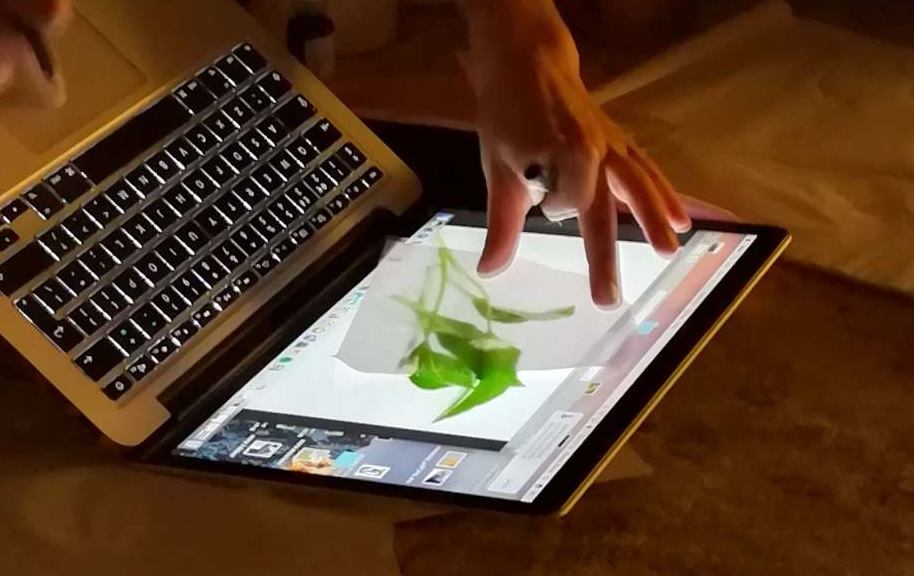
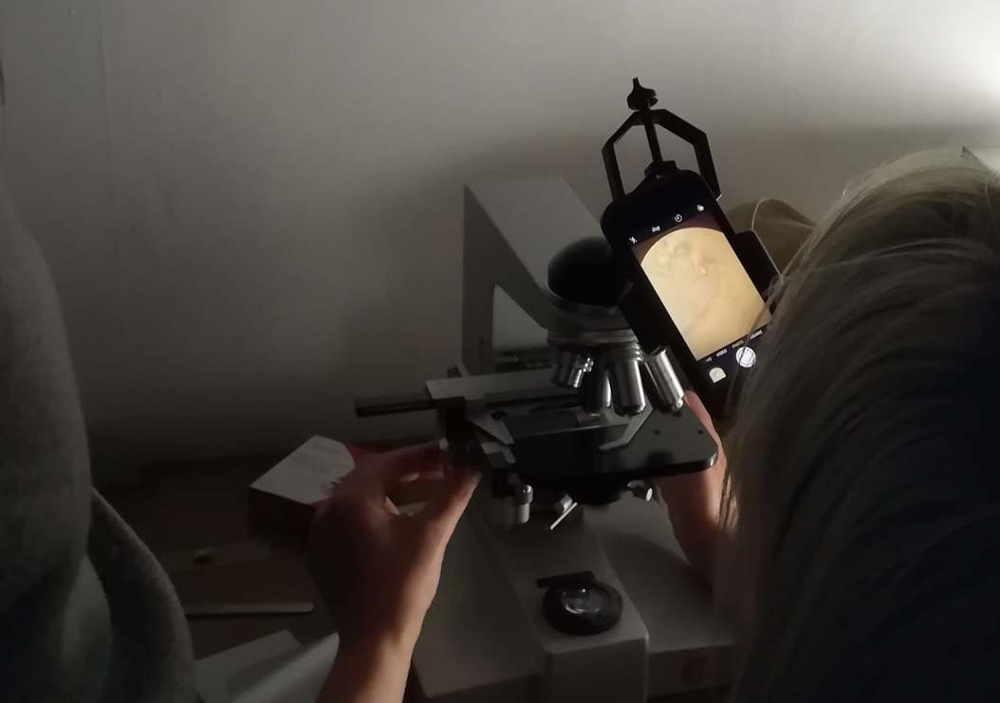
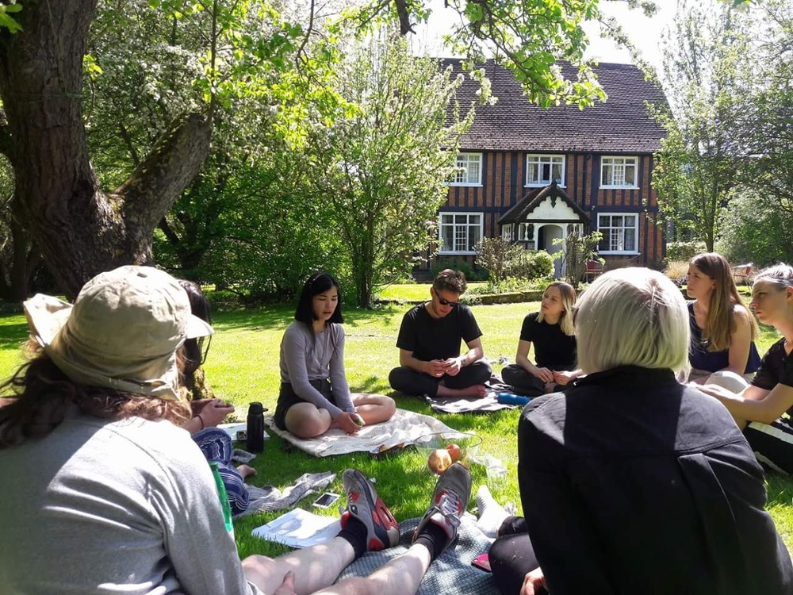
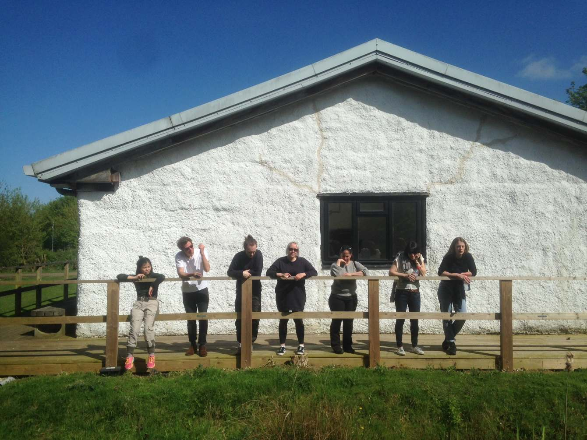
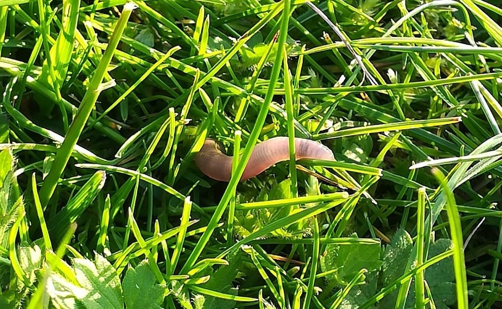

(May 4, 2018 → May 6, 2018) I joined a 4-day retreat organised by artists Julia Crabtree and William Evans, who brought together a group of artists, writers and researchers at Wysing Arts Centre. Together with Katrina Black, Jamie Bracken Lobb, Lilah Fowler, Karen Kramer, Alice Hattrick, Rachel Pimm and Jamie Sutcliffe, our group spent time sharing works-in-progress, and took walks in the fields and spent time at the Wysing farmhouse. We heard from the artist duo about their long-term research themes and the development of their recent exhibitions 'Gullet' and 'Gulch', which led to further group discussions on our research practices that relating to the themes of ecologies, kin, care and collective learning. 

Find out more about Julia Crabtree and Will Evans [here](https://www.crabtreeandevans.co.uk/selectedwork/gullet) and Wysing Arts Centre [here](https://www.wysingartscentre.org/)

