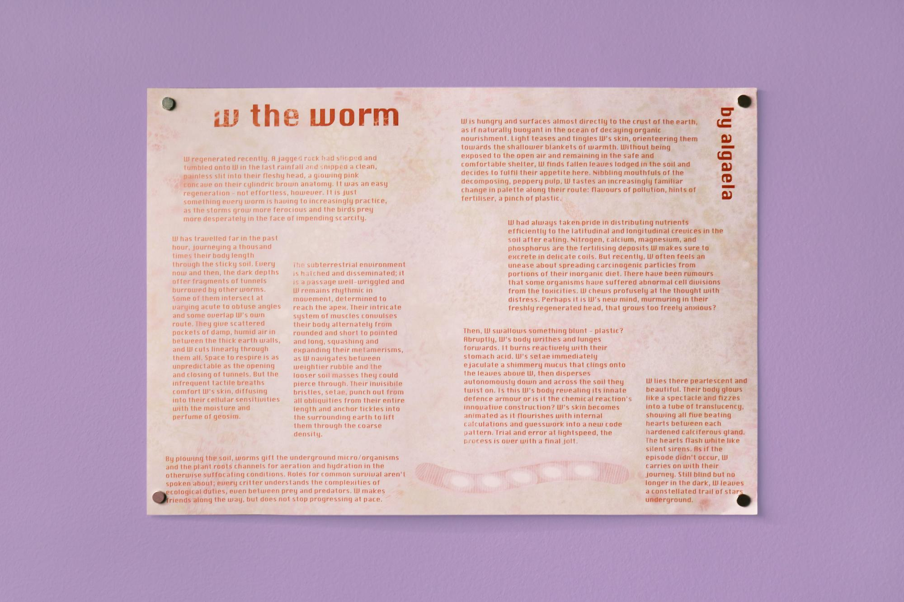

(May 26, 2018 → July 1, 2018) My story 'w the worm' was published for The Institute of Queer Ecology (IQECO)'s Towards A Common Survival, a compilation of 33 creative contributions in light of the increasingly difficult political spaces for justice work. A wall print of my story and the gathering of work for Towards A Common Survival was exhibited at Prairie in Chicago. 

--- 

"The Institute of Queer Ecology (IQECO) was founded, out of necessity, as an act of resistance. It is an institute of hope and relentless optimism towards a utopian ideal, asking only for a place in this world for organisms of every kingdom, gender, and sexuality. IQECO evolved in the tidepool of fear and urgency that followed the 2016 election. In the past 17 months, the Trump administration has pulled out of the Paris Climate Accord, restricted the rights of transgender inmates, appointed a climate science denier to the helm of the EPA, quietly removed the Presidential Advisory Council on HIV/AIDS, and made countless (relentless) other steps towards the erasure of environmental and LGBTQ+ concerns. The question at hand now is simply: How Do We Survive?

That question is loaded. Many of us are growing numb to the bombardment of slow violence which disproportionately affects groups of people that have historically experienced injustice. This resurgence of biopolitical control, overt racism and (capitalistic) environmental destruction in America angers many of us but is also actively destroying peoples lives. Personal survival is not on all of our individual minds, but Common Survival—for our extended communities—needs to be.

Common Survival manifests as a multiformat publication, contained within an 11 x 17 x 5 inch box. The 33 included projects appear as texts, zines, screen prints, photographs, sculptural objects, poems, video, audio recordings and other hybridized modes of research display.

At the conclusion of the exhibition 'Common Survival' will be available to loan from the Institute of Queer Ecology."

Find out more [here](https://queerecology.org/Common-Survival-at-Prairie)