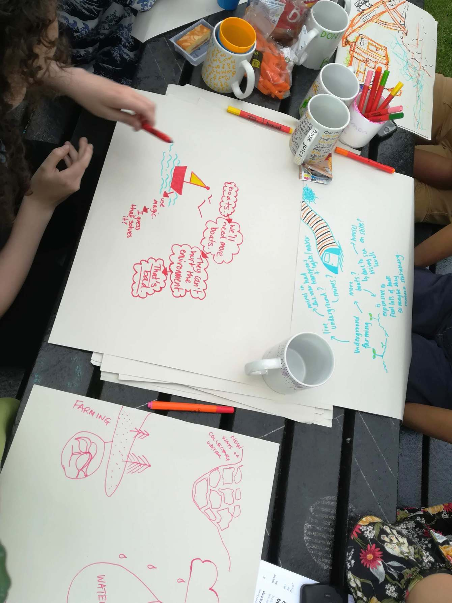
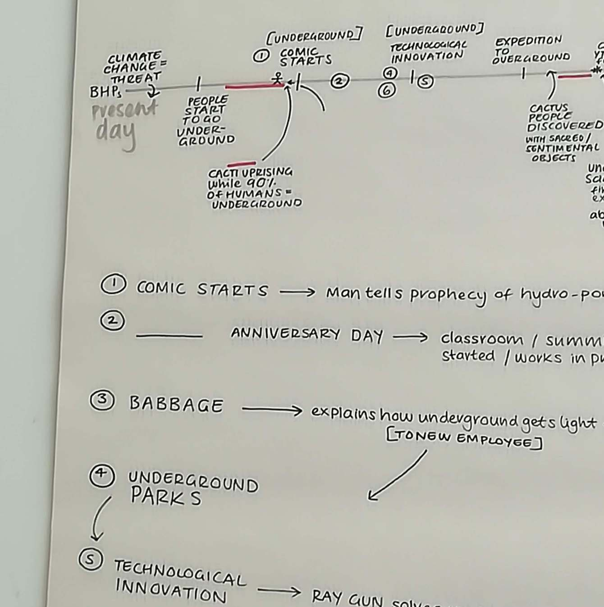
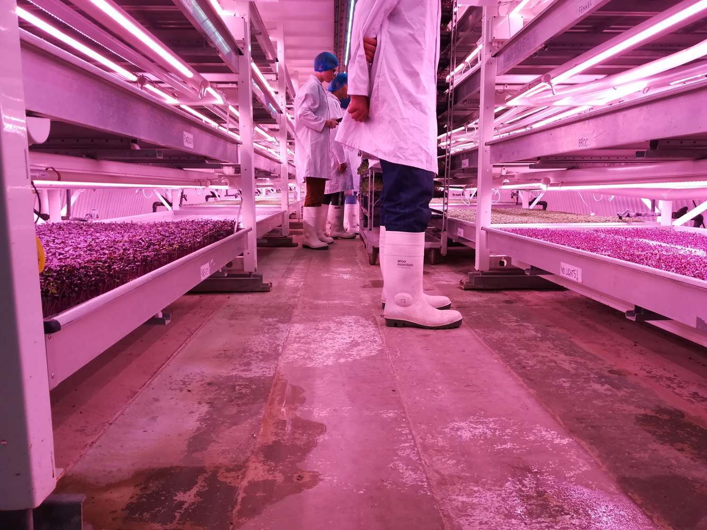
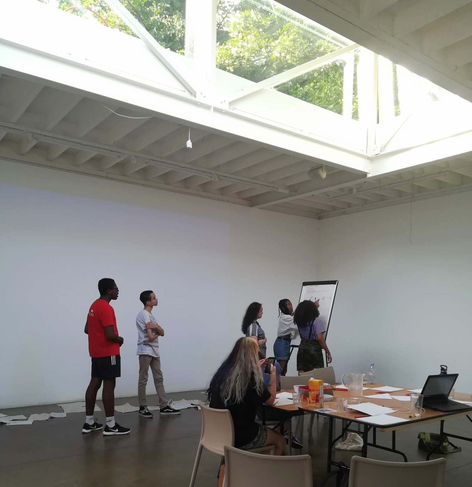
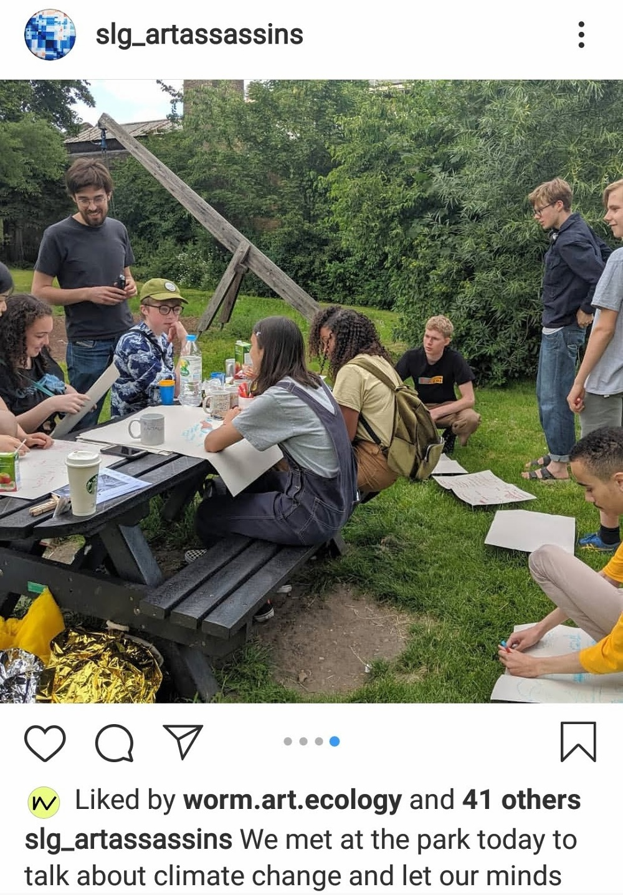

(June 18, 2019 → August 20, 2019) Over the summer of 2019 I worked together with The Art Assassins on a weekly basis at South London Gallery. Together we developed a new climate fiction comic book that weaves together multiple speculative futures. We ideated through workshop activities like sharing media and knowledges about climate issues, narrative mindmapping, drawing, collaging and debates. As part of the research our group visited an underground farm in south London. The farm, which produces salad sprouts, is both a real experiment in alternative, greener food production and a space that got the group thinking about visualising the future, with its striking purple lighting in the long tunnels.It inspired both debate on the shortcomings of seemingly 'green' ideas and businesses focusing on consumption, and what kinds of locations and technologies could appear in our imaginative climate narratives.

"The Art Assassins, the SLG’s young people’s forum work together with contemporary artists, designers, filmmakers and each other to create a programme of events for other young people and a wider audience. The Art Assassins are a diverse group of young people aged between 14-20 years old who meet every Tuesday at the South London Gallery."

"Art Assassins’ projects are always led by the members. Together they have curated exhibitions and events, formed a political party, directed a short film, slept in a forest, made a video game, designed hair products and reinvented the archive. The group formed in 2009 and through their collaborative projects they have defined a unique peer-led approach to create platforms which represent themselves and their ideas."

Find out more [here](https://www.southlondongallery.org/projects/art-assassins)

