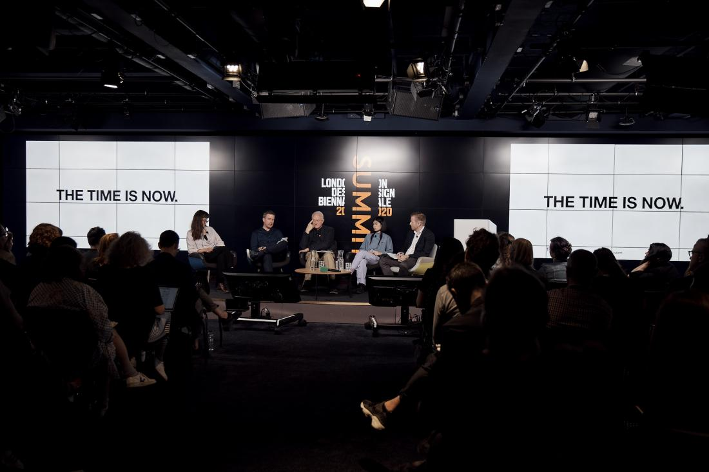

By invitation of Es Devlin, Artistic Director of the London Design Biennale 2020, I presented and took part in a discussion in the Environmental Resonance segment with Francesco Bandarin (Aga Khan Trust, formerly UNESCO), Ben Parker (Made Thought) and Sarah Grahn (White Arkitekter) and chaired by Stephen Jamieson (SAP). 

"London Design Biennale's inaugural Summit will take place from 25-26 June 2019. The Summit focuses on Resonance, the theme for London Design Biennale 2020.

The Summit will address the impact of design: its power to cross borders, bridge cultures, and alter behaviours and societies. It will look at how this can improve a variety of major global issues, including climate change (our resonance with the planet); and international relations (how countries resonate with each other). The Summit will be attended by designers working internationally; diplomats; and cultural institutes."

Find out more [here](https://worldarchitecture.org/article-links/eceef/london-design-biennale-2020-reveals-its-firstever-summit-program-and-speakers.html)

