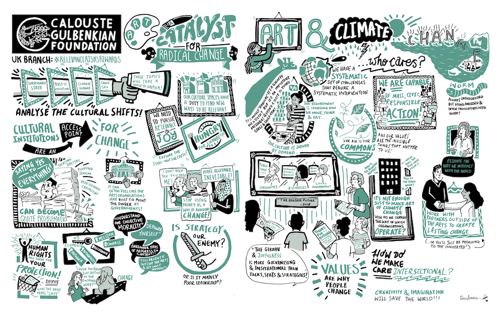

As part of one of five one-day gatherings (Manchester, Gateshead, London, Birmingham) I gave a talk at the Bristol event to discuss the civic role of art for radical change with members of arts organisations and institutions. I spoke about the need for institutions to support environmental and climate justice, particularly in line with supporting precarious art workers and understanding the racial injustice in the UK arts' for these areas. In the open discussion, I pointed out the lack of diversity in the space that aimed to explore what civic arts and radical change would look like, and encouraged not only representation during these ideatation sessions, but also longer term employment of minoritised art workers (eg by race, disability) into decision making roles. The event contributed to Calouste Gulbenkian Foundation’s Civic Role of Arts Organisations Programme in the UK. 

"A series of five one-day gatherings convened by
the Foundation in 2019, around the theme
of ‘Relevance, Risk, Rewards’ aimed
to raise the profile of the Programme, in the
wake of the Inquiry, and to showcase some of
the different ways organisations were working
with communities and local civic networks. It
also sought to bring together people working
across the sector who may have been less
familiar with the Inquiry and the Programme,
and subsequently to identify potential areas for
future focus.

- ‘Partnerships, People and Power Dynamics’
at The Whitworth, in Manchester.
- ‘The Art of Cultural Democracy’
at Sage Gateshead, in Gateshead.
- ‘Cultural Spaces: Temples or Town Halls?’
at the Wellcome Trust, in London.
- ‘Art: A Catalyst for Radical Change’
at the Arnolfini, in Bristol.
- ‘Flagship Cultural Events: a Debt or
Opportunity for the Community?’
at Birmingham Rep, in Birmingham." 
- The Civic Role of Arts Organisations: From Inquiry to Movement - Learning Report (2023), Calouste Gulbenkian Foundation, Thinking Practice

Find out more [here](https://gulbenkian.pt/uk-branch/news/reflections-from-relevance-risks-rewards/) and for the report via CGF and KCL [here](https://www.kcl.ac.uk/cultural/resources/reports/cgf-civic-role-literature-review-final.pdf)

Image: Scriberia via Calouste Gulbenkian Foundation 