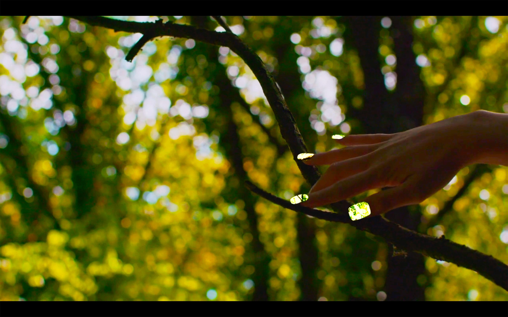

(July 13, 2019 → September 20, 2019) I was invited by The Otolith Group to provide climate science research to inform part of the narrative for their film Infintity Minus Infinity (2019) and to perform with moss, green screen nails and the natural environment (after my project 'mossy soft spot'). 'Infinity minus Infinity, brings together dance, performance, music, recital and digital animation to compose a transhistorical zone in which the unpayable debts of racial capitalism cannot be separated from the ongoing crimes of capitalogenic climate catastrophe. The work enacts the durational timelines of past distress, present duress and future dread through the assembly of a chorus of transtemporal deities whose utterances, expressions, gestures and movements personify the compounded, accumulated, irreparable times and spaces of the hostile environment.'

Watch the trailer [here](https://vimeo.com/ondemand/infinityminusinfinity) and find out more [here](https://otolithgroup.org/work/infinity-minus-infinity)

Images: The Otolith Group, Infinity Minus Infinity - Still from Video (2019)
