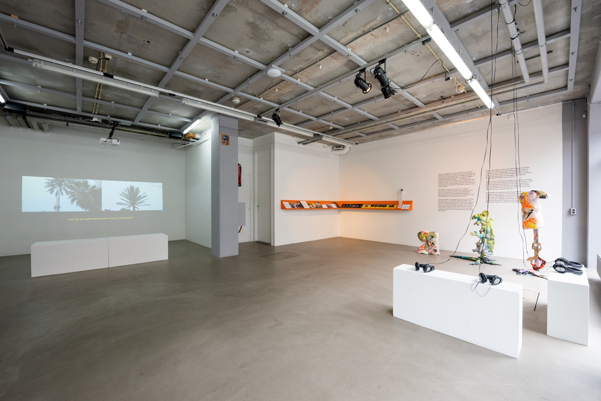
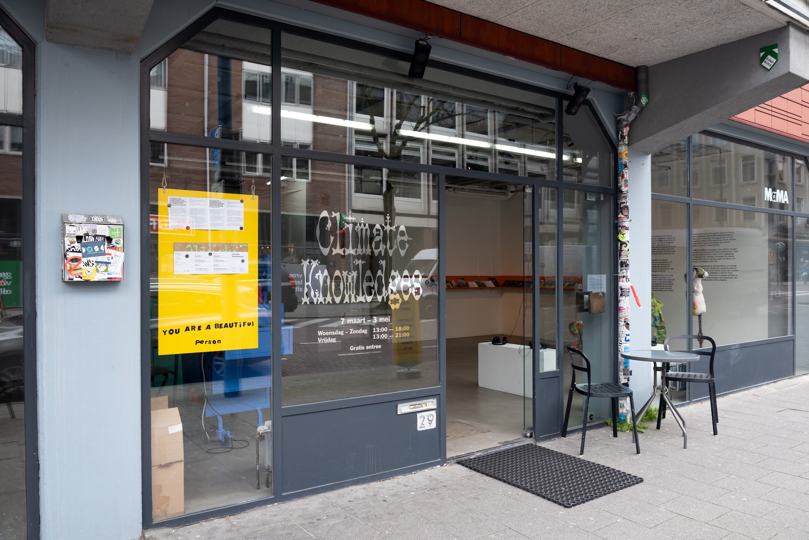
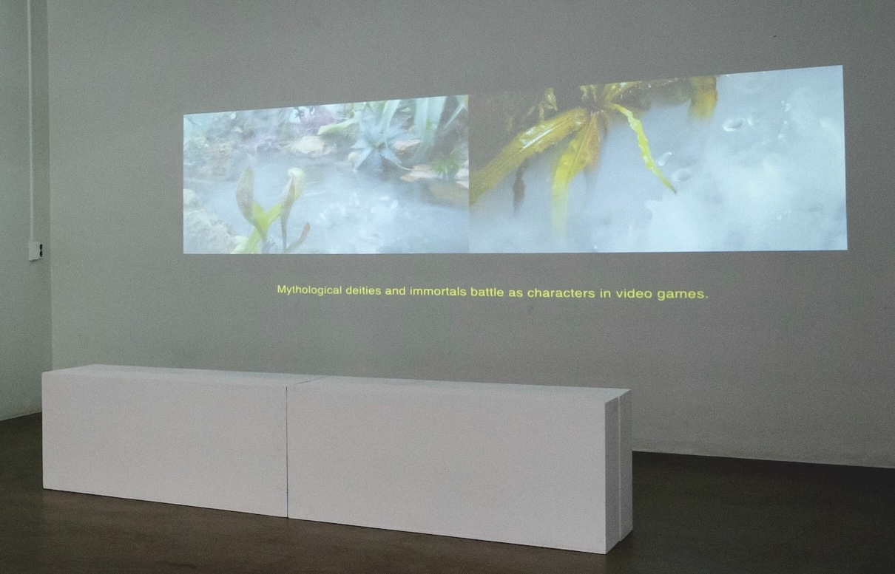
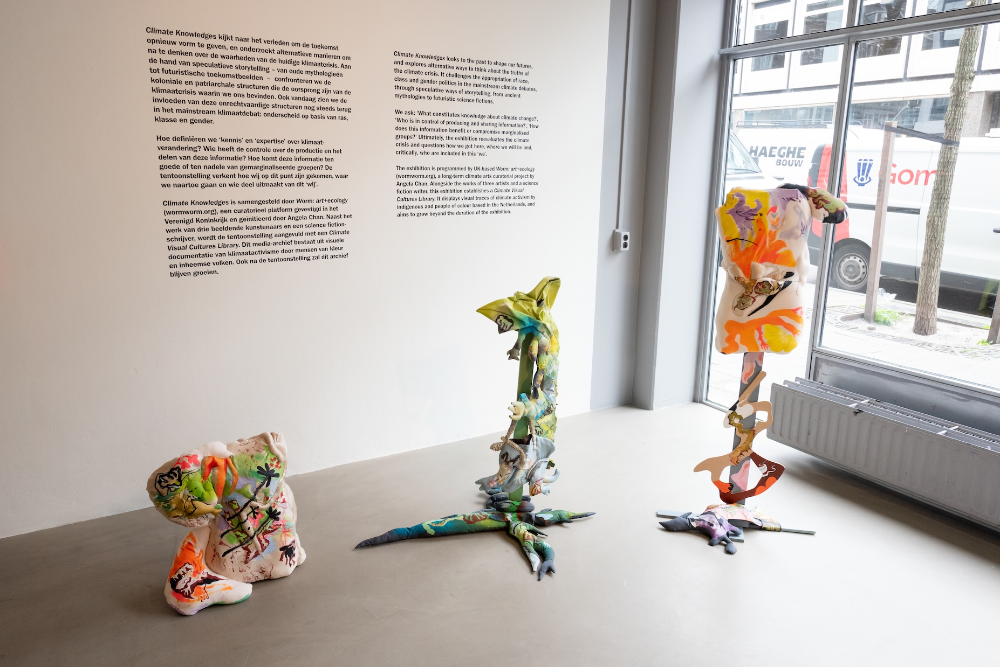
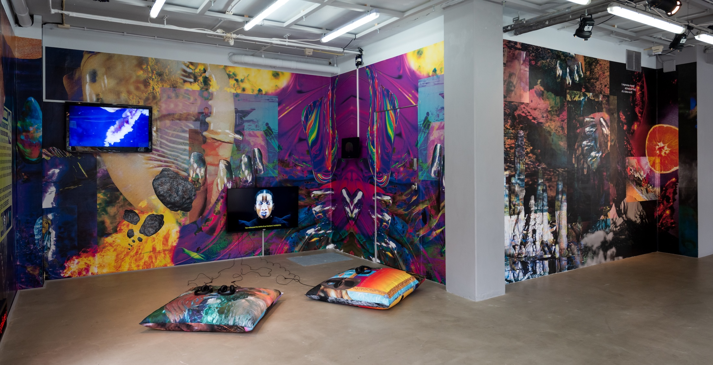
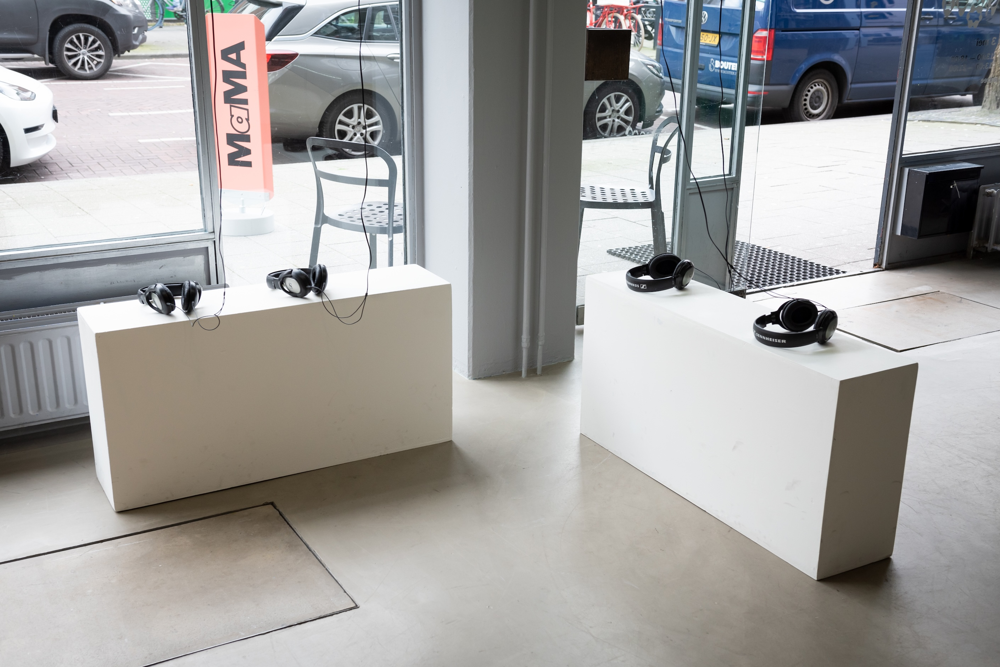
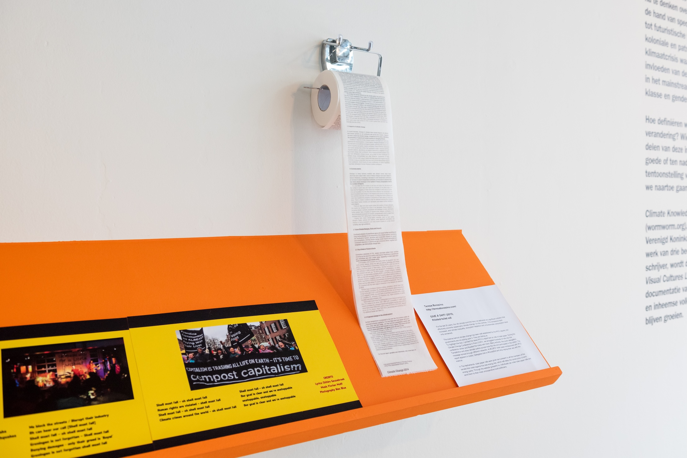

(March 7, 2020 → July 03, 2020) I was commissioned to guest curate an exhibition for MAMA (Showroom for Media and Moving Art), on the Witte de Withstraat in Rotterdam about my research in climate change and justice. I framed the concepts around speculative fictions, histories and everyday knowledges of climate change across cultures and geographies. 'Through speculative ways of storytelling, from ancient mythologies to futuristic science fictions, we confront the colonial and patriarchal origins, and their exploitative processes, that produced the current climate crisis.'

Invited exhibitors were Annie Mackinnon (UK), Josèfa Ntjam (FR) and Regina Kanyu Wang (CN) with Tessa Qiu (UK), and local activists to form the Climate Visual Cultures Library. The indigenous and climate activists of colour based in the Netherlands were Chihiro Geuzebroek (Radical Friends (film, 2014), Shell Must Fall, Climate Liberation Bloc, Aralez) Teresa Borasino Fossil Free Culture NL Wij Stoppen Steenkool Free West Papua Campaign NL. 

---- 

# Original Press Release

Worm: art+ecology has been invited to programme a public exhibition and series of events at MAMA in Rotterdam. Opening on 7th March for Museum Night, it was scheduled to run until 3rd May 2020 with a closing event. In light of the closure of the gallery in mid-March due to COVID-19, 'Climate Knowledges' can now be visited as a virtual exhibition with rearranged events running online until late June.

'Climate Knowledges' invites you to challenge today’s mainstream discourse surrounding climate change and to rethink its histories, presents and futures. It is a project with Annie Mackinnon (UK), Josèfa Ntjam (FR) & Regina Kanyu Wang (CN) with Tessa Qiu (UK). As well as workshops and performances by the exhibiting artists, this exhibition establishes a Climate Visual Cultures Library with indigenous and climate activists of colour based in the Netherlands.

Understandings about our climate have long-existed as embodied experiences and knowledges shared across generations. Together with three visual artists and one science fiction writer 'Climate Knowledges' looks to the past to shape our futures, and we explore alternative ways to think about the truths of the climate crisis. Through speculative ways of storytelling, from ancient mythologies to futuristic science fictions, we confront the colonial and patriarchal origins, and their exploitative processes, that produced the current climate crisis. Today, we still see the influences of these origins with the appropriation of race, class and gender politics in the mainstream climate debate.

Only a reconciliation of these prejudiced histories of climate change can bring about just futures for Black, Indigenous and people of colour. With 'Climate Knowledges', the artists’ works collectively resist the injustices that contributed to and sustain climate change. We ask: ‘What constitutes knowledge about climate change?’, ‘Who is in control of producing and sharing information?’, ‘How does this information benefit or compromise marginalised groups?’ Ultimately, the exhibition reevaluates the climate crisis and questions how we got here, where we will be and, critically, who are included in this ‘we’. ️

---- 

# Exhibited Works

 
 
Annie Mackinnon’s (UK) film and soft sculptures compose A Sublime Sky, A Technological Eye (2020). Together, they explore Chinese mythologies and philosophies to re-articulate our entanglements with the environment and critique exploitative techno-futures.

Josèfa Ntjam’s (FR) speculative film and wall graphics traces the monster in the time of cyborgian hybridity and climate change. Drawing upon Drexcyian myths, Mami Wata, and colonial histories of Central and West Africa, Ntjam's Alchemical Tract of a Beta World (2020) narrates fictions and truths towards a decolonial, trans-feminist empowerment.

Science fiction writer and scholar Regina Kanyu Wang (CN) imagines interspecies knowledge systems and communication methods through her queer ecology short story, The Story of Dǎo (2019). It is adapted as a sound piece for ‘Climate Knowledges’, narrated by musician Tessa Qiu (UK).

The Climate Visual Cultures Library is an evolving archive of visual material from campaigns by Indigenous, Black and people of colour climate activists, who organise in the Netherlands. With contributions so far spanning posters, pamphlets, stickers, texts, song lyrics… and a policy-printed toilet roll, the CVC Library encourages learning, sharing and discussion. It presents the long and ongoing history of the climate justice movement led by Indigenous, Black and people of colour, who show that climate resistances are inseparable from the wider global social justice, human rights and decolonial independence campaigns. 

---

Funded by Mondriaan Fund, Het Nieuwe Instituut, Gemeente Rotterdam, Stichting Bevordering van Volkskracht and MAMA. 

# Events for Climate Knoweledges at MAMA
Witte de Withstraat 29-31, 3012 BL Rotterdam and online: 

- 7 March / 20:00 – 01:00
Opening: Climate Knowledges
During Museumnacht 010, with an additional programme by Team MAMA.

- 23:00 - 04:00 @ Ballroom
Climate Knowledges Afterparty
Organised by Worm: art + ecology with London club night Rani.

- 29 April / 16:00 - 17:30 CEST ~ online ~
Sing-a-long: Decolonial Climate Justice Workshop
A workshop with Climate Visual Cultures Library contributor Chihiro Geuzebroek, a filmmaker, songwriter and performer active in the climate movement. More information here and register for free here.

- ~ Rescheduled for online - June 15 (tbc)~
Reflections on Making Practices
Workshop on sustainable making manifestoes and practices by Annie Mackinnon.

- ~ Rescheduled for online -June~
I Am Nameless
A performance by Josèfa Ntjam.

Image: [Al Walker](https://www.alwalker.biz/) commissioned for Climate Knoweledges' graphic design 