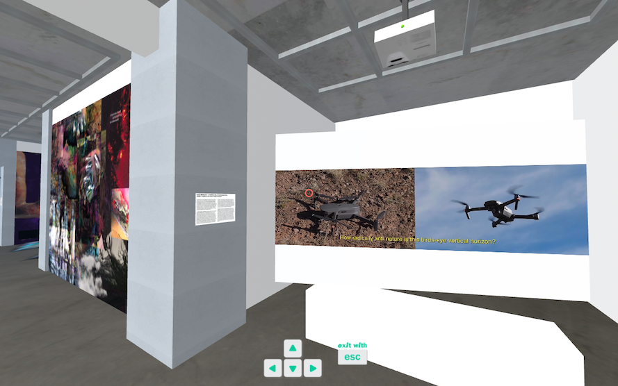
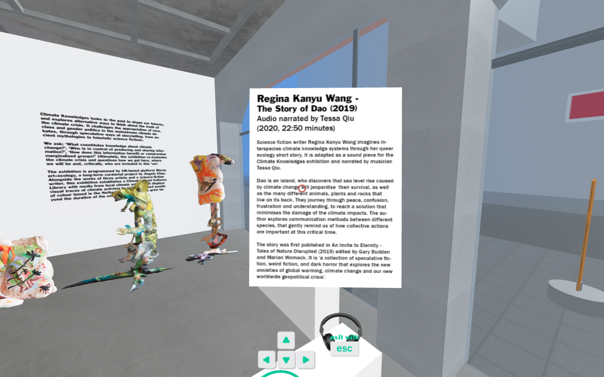
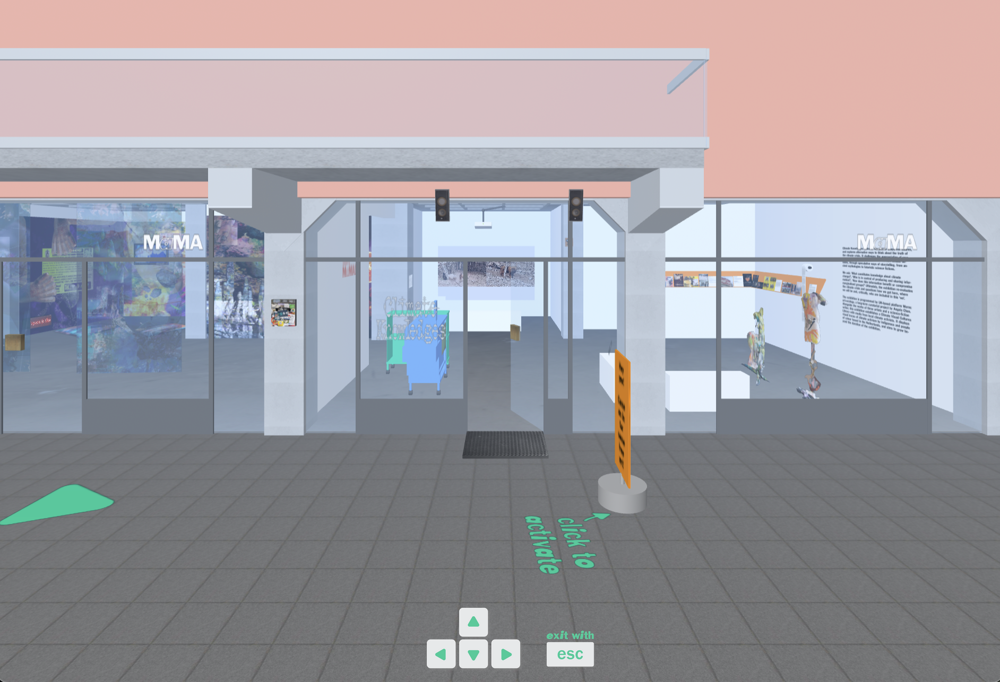

(May 2, 2020 → July 3, 2020) My exhibition as Worm: art + ecology, Climate Knowledges, on show at MAMA Rotterdam, was adapted as a virtual exhibition experience as a result of the pandemic lockdown in the Netherlands. 

Game designers Louisa Teichmann and Noemi Biro translated the artworks through photogrammetry and digital files of the artist and activists works. 

The virtual exhibition is viewable [here](https://thisismama.nl/virtualshowroom/climateknowledges.html)

