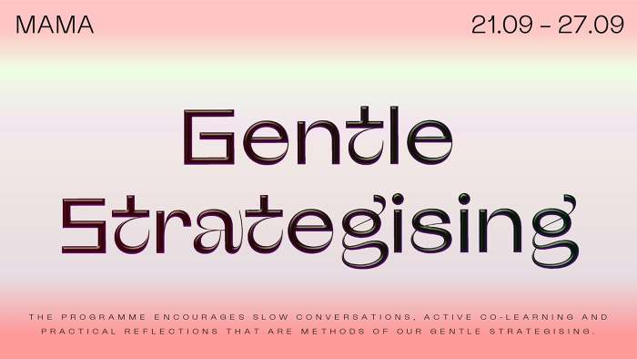

(September 21, 2020 → September 27, 2020) Gentle Strategising was a full week of collective activities, organised by MAMA Rotterdam's 2020 'poule of programme makers' (Angela Chan (Worm: art + ecology), Leana Boven, Arvand Pourabbasi and Golnar Abbasi (WorkNot!), and Mary Ponomareva) in collaboration with local arts and activism groups. The space within and outside MAMA’s Showroom became sites for slow, open, creative, and reflective activities that strategically confronted urgent global injustices – reinforced by the pandemic, climate, racial and socio-economic injustices – at a local level. 

The programme encouraged slow conversations, active co-learning and practical reflections that were methods of our Gentle Strategising. Through scheduled daily activities facilitated by our invited groups, a small press and zines ‘window bookshop’, banners and mural art, and online participation and streaming, Gentle Strategising offered a week that nurtured respectful and collaborative strategising as the foundation for just and safer spaces.

“We hope to inspire, inform and generate equitable futures that centre the existing, invaluable work of local artists and activists to these causes. We seek to support marginalised activism through redistributing material resources, advocating these aims throughout our week, and creatively documenting the breadth of work as a form of radical self-archiving.”

Tuesday
[Kontra](https://www.instagram.com/kontra.rotterdam/)
[Eun J Lee](https://www.instagram.com/crrrrng/)

Wednesday
[Doe Het Zelf Werkplaats](https://www.instagram.com/dhzfietswerkplaats/)

Thursday
[Nights of Philosophy](https://www.instagram.com/nights_of_philosophy/)

Friday
[Cultural Workers Unite](https://www.instagram.com/cultural.workers.unite/)

Saturday
[Verbalism](https://www.instagram.com/verbalism010/)

Sunday
[Klauw](https://www.instagram.com/klauwcollective/)

Find out more at MAMA Rotterdam [here](https://thisismama.nl/en/events/home-en/gentle-strategising/)

Images: [Mary Ponomareva](https://www.mary-universe.com/)