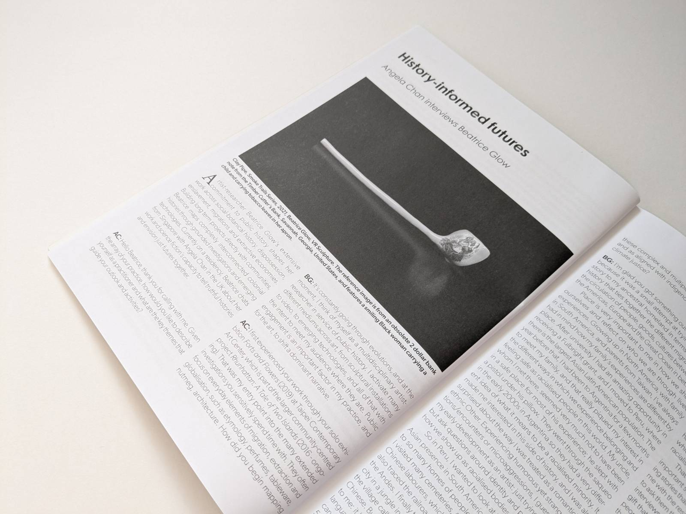

For the Chinese SF Edition of Vector (No.293, Spring 2021), guest edited by Yen Ooi and Regina Kanyu Wang, I interviewed artist [Beatrice Glow](https://beatriceglow.org/) about her work with colonial histories and science fiction's capactiy to help ‘tell truthful histories and envision just futures together’. I use my term 'history informed futures' as a base that resonates with us both as artists working with historical, contemporary and sf narratives, through community collaborations and digital media technologies. I'd been an admirer of Beatrice's work for years and it was a great opportunity to engage deeply in the richness of her work and values.  

"Vector 293 is a collaboration with guest editors Yen Ooi and Regina Kanyu Wang. Yen Ooi introduces the issue as well as many of its recurring concepts, such as techno-orientalism. Regina Kanyu Wang takes us through the history of women writing SF in China. Artist and curator Angela Chan interviews Beatrice Glow about her work with colonial histories and the ability of science fiction to ‘tell truthful histories and envision just futures together’ through art. The conversation about history, futures, science fiction and art continues in Dan Byrne-Smith’s interview with Gordon Cheung. Chinese SF scholars Mia Chen Ma, Frederike Schneider-Vielsäcker and Mengtian Sun offer glimpses of their recent and ongoing research. Authors Maggie Shen King (An Excess Male) and Chen Qiufan (Waste Tide) interview each other about their recent novels. Feng Zhang introduces us to the SF fandom in China, while Regina Kanuy Wang brings us up to speed with accelerating Chinese SF industry. Dev Agarwal questions the maturity of the Chinese SF blockbuster as can be judged from Shanghai Fortress and The Wandering Earth (both available on Netflix). Virginia L. Conn explores Sinofuturism, while Emily Xueni Jin delves into the implications of translating a growing body of SF work from Chinese into English. We learn about the global perspectives on Chinese SF from an illustrious panel assembled at WorldCon 2019, and about transnational speculative folklore of the Uyghur people from Sandra Unerman. Niall Harrison completes the issue with an illuminating survey of Chinese short SF in the 21st Century."

Find out more [here](https://vector-bsfa.com/2023/10/17/vector-293/)