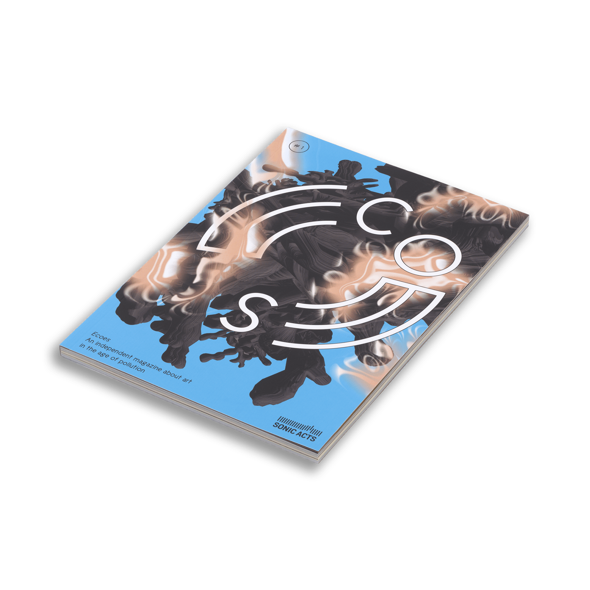

For Ecoes #1, an independent magazine about art in the age of pollution by Sonic Acts in light of the inaugural OVEREXPOSED Residency, I was featured by Victoria Douka-Doukopoulou. As an artist in residence, my work and research were outlined as a profile. 

"The first issue of Ecoes brings together artists that focus on mining, microplastics, the origins of the blues from an Indigenous perspective that sees humans as entangled with the environment, Cold War toxic legacies and depleted uranium, invasive species and deadly clouds in one of the epicentres of extractivist operations in the Russian Arctic. Among the contributors, Sissel Tonn shares her thoughts on immunology, sentinel species, scales, and inequality in an interview about her audio walk Plastic Hypersea commissioned by Sonic Acts. The six residency recipients of OVEREXPOSED deliberate on various spatial and temporal scales of pollution, while the pieces in Night Air respond to myths that hold foul air from decaying organic matter as causing illness.

Ecoes is a magazine about sound art, technology, and ecology, published by Sonic Acts. A portmanteau of ‘ecology’ and ‘echoes’, it is rooted in environmental concerns and investigates how auditory practices shape our understanding of contemporary worlds — human and nonhuman. Through critical essays, artistic contributions, and interviews, each issue amplifies alternative ways of sensing, interpreting, and intervening in a rapidly changing planet." 

Find out more [here](https://shop.sonicacts.com/product/ecoes)