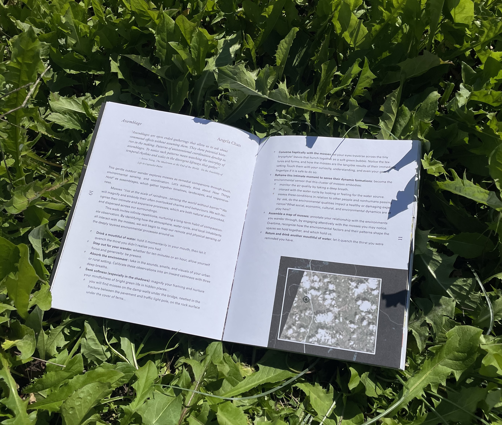

I contributed to the first entry of the lexicon for In, From, and With: Exploring Collaborative Survival Book which has a preface by Anna Tsing. My piece, 'A: Assemblage', takes mosses as an inspiration to explore methods of holding hydration, gentleness and orientation. 

'In, From, and With: Exploring Collaborative Survival is a collectively constructed lexicon that collates a series of terms selected by twenty-four contributors, ranging from botanists to artists to agricultural producers and more. The interactive book, including edible and non-edible recipes, explores the notion of collaborative survival through a series of sensorial pedagogies, implementing the body as a fulcrum for digesting terminology. In, From, and With romances the possibility of reading and doing as a means of metabolizing, braiding together practice and pedagogy through an intimate inquiry of contemporary consumption.

Preface by Anna Tsing. Contributions from Adwoa Addae, Angela Chan, Asha Mines, Agustine Zegers, Catriona Sandilands, David Horvitz, Eden Batki, Fernando García-Dory, Jessie French, Jo Vávra, Justine Parkin, Institute for Interspecies Arts and Relations, In Co Lab, Lichen Kelp, Loren Kronemyer, Noon Tran, Nora Slade, Oola, Sanctuary Slimane, Sara Graorac, Sarita Dougherty, Sean Roy Parker, Sophia Winitsky, Susanna Battin, Terrapolis Collective, and Tarangini Saxena. Designed by Gal Sherizly. Printed by Offset Santiago.'

Find out more [here](https://gracegloriadenis.com/In-From-and-With)