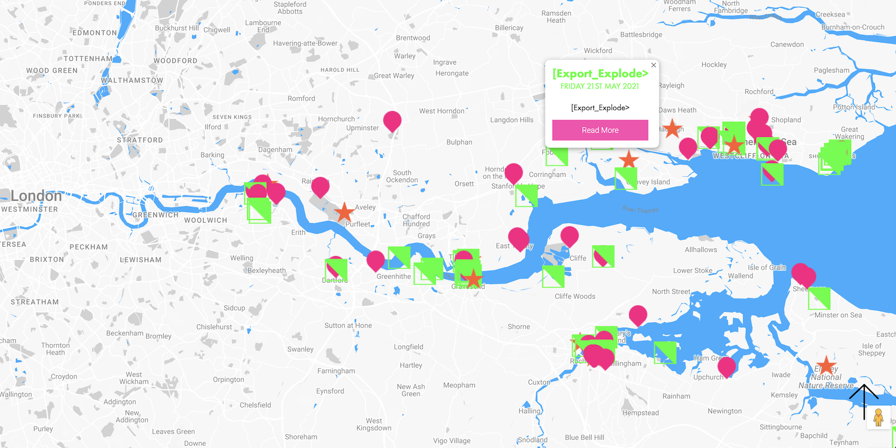
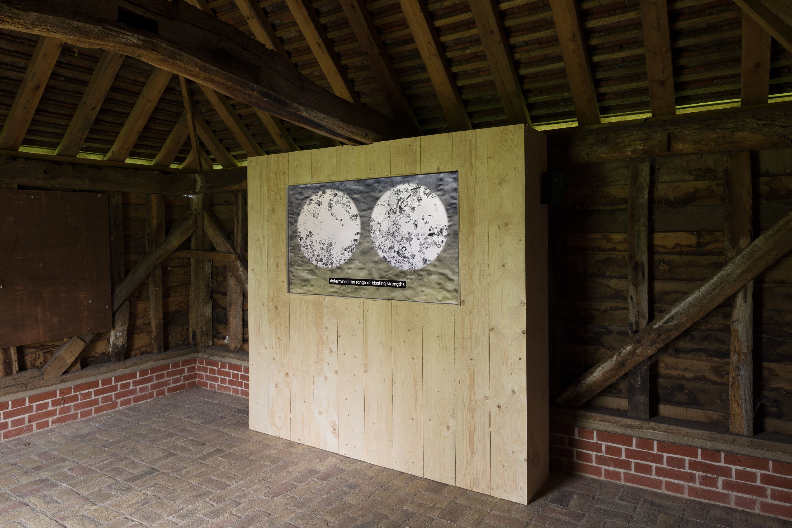

(May 21, 2021 → June 12, 2021) [Export_Explode> is a video essay that identifies the unfinished histories of Britain’s explosives manufacturing, from their use in industrial and imperial expansions worldwide since the late 19th century, to their active legacies in contemporary extractivism and conflict. It was exhibited on the existing Explosives Trail onsite at the former Pitsea Explosives Factory on the Thames Estuary as part of Estuary 2021 for Metal Culture. 

[Export_Explode> surveys how the British Explosives Syndicate and Alfred Nobel ensured their dynamites lay the technological and commercial frameworks for global resource extractions by blasting and mining, to the benefit of the British Empire, its clients and its wartime allies. The project expands towards Pitsea Explosives Factory's international histories for the first time, to centre the journeys of Nobel’s explosives once they left Pitsea, as they traversed by water domestically and overseas to be detonated and cause irreversible degradation to landscapes and communities worldwide.

[Export_Explode> further explores how these strategies for profit and power have evolved into other forms since the factory closed in 1929, in so-called ‘peacetime’. The project is produced in acknowledgment of the UK Government’s recent increased funding in the defence sector, its largest since the Cold War. It relates history to the present in how Britain’s arms trade and colonial legacies continue to drive unrest and conflict today, especially in regions of the world already rendered vulnerable by climate change and exhaustive natural resource extraction. [Export_Explode> also responds to the rising anti-immigrant sentiments and resurgent nationalism that are extensions of British colonial practices.

These issues connect back to the former explosives factory site, which is now a popular bird watching nature reserve, Wat Tyler Country Park. [Export_Explode> compares the ecological revitalisation of a place that was once a key manufacturer of explosives, with the long term ecological and human destruction its products scarred in various global geographies, to consider devastation, displacement and migration. It reminds that Britain’s heritage sites are not neutral, and their cultural narratives must reflect on Britain's complex, violent and ongoing histories that are complicit in today’s anxieties and geopolitical activities involving resource scarcity, conflict and climate change.

[Export_Explode> at Wat Tyler Country Park, in Pitsea, Essex, among the many sites of the festival Estuary 2021 

Throughout my commission with Metal Culture for Estuary 2021 (origianlly Estuary 2020 with a postponement due to the pandemic), I worked with Thea Behrman, Ans M for sound design, and the Wat Tyler Country Park Education Team. 

Installation view on the Explosives Trail at Wat Tyler Country Park (image by Jonathan Juniper)

Find out more [here](https://www.estuaryfestival.com/event/detail/export-explode.html)