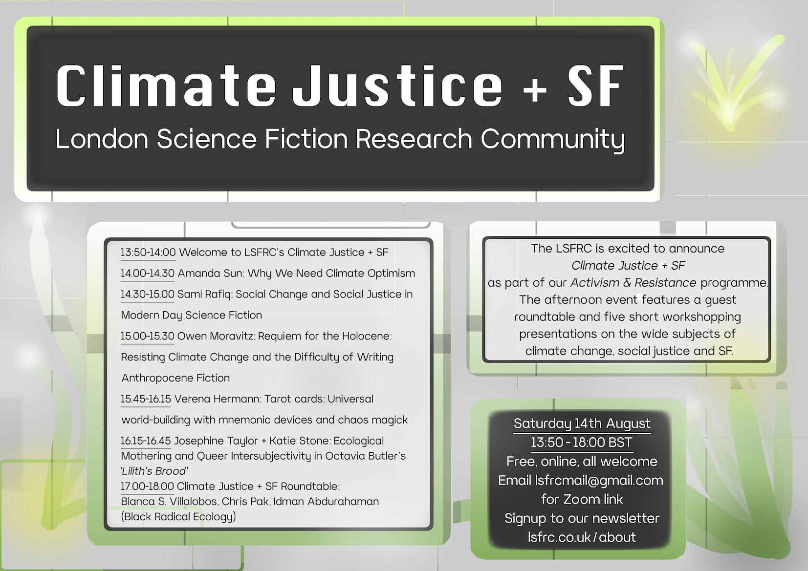

As part of the LSFRC's annual theme 'Activism and Resistance', I organised a day's conference focused on climate justice and science and speculative fictions. For Climate Justice + SF, the afternoon event featured artists, organisers and scholars working in climate justice and its themes around the world. We had a selection of workshop-style presentations and discussions, and the day concluded with a guest roundtable featuring Blanca S. Villalobos, Idman Abdurahaman and Chris Pak. 

Schedule of Speakers for Saturday 14th August, 13:50-18:00 

13:50-14:00 Welcome to LSFRC’s Climate + SF event

14.00-14.30 Amanda Sun: Why We Need Climate Optimism

14.30-15.00 Sami Rafiq: Social Change and Social Justice in Modern Day Science Fiction

15.00-15.30 Owen Moravitz: Requiem for the Holocene: Resisting Climate Change and the Difficulty of Writing Anthropocene Fiction

15.30-15.45 Break (15 mins)

15.45-16.15 Verena Hermann: Tarot cards: Universal world-building with mnemonic devices and chaos magick

16.15-16.45 Josephine Taylor + Katie Stone: Ecological Mothering and Queer Intersubjectivity in Octavia Butler’s Lilith’s Brood

16.45-17.00 Break (15 mins)

17.00-18.00 Climate Justice + SF: Roundtable: Blanca S. Villalobos, Chris Pak, Idman Abdurahaman

Find out more [here](https://www.lsfrc.co.uk/events/climate-justice-sf/)