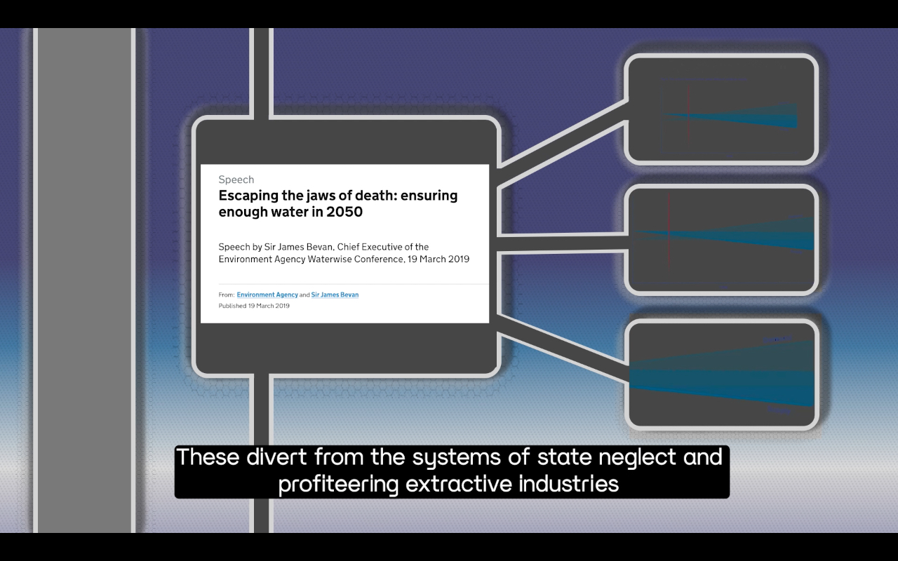
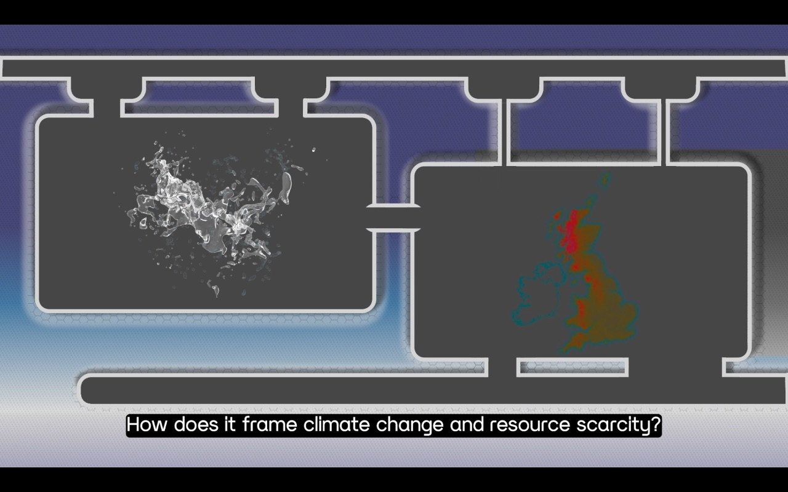
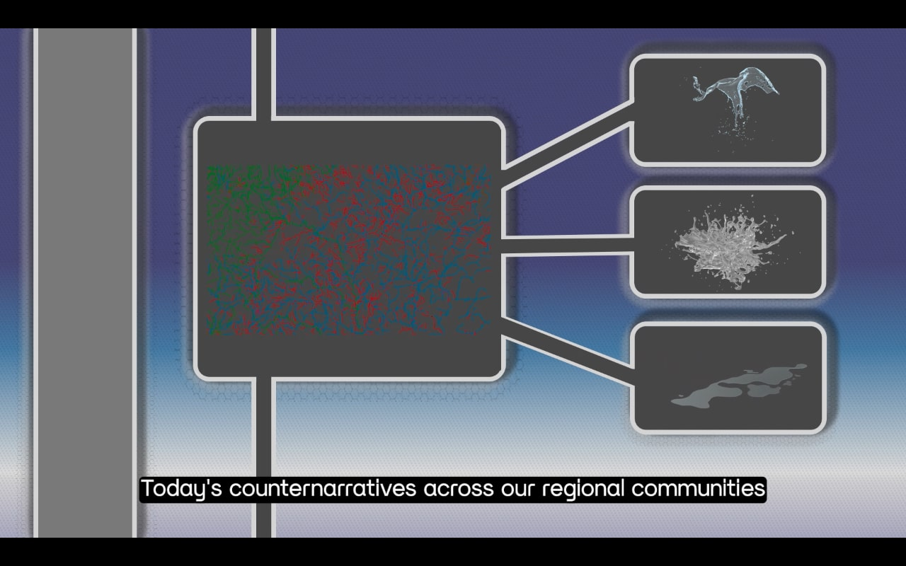
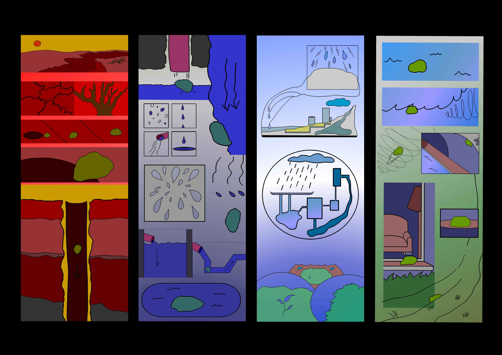

(September 15, 2021 → October 3, 2021) To culminate my year-long Jerwood Arts FACT Digital Fellowship, my artwork Rain Paradox (2021) - consisting of a video in collaboration with residents across the UK and a four-part illustrated banner collection - is exhibited at FACT Liverpool. The project gathers research around climate narratives about water scarity in the UK, and I present how official and local climate framings differently influence our public views of climate change. 

---

Rain Paradox (2021)
Video with sound by aircode, (70 mins) 

The Great British Rain Paradox, published in 2020 by RB Finish and supported by the UK government’s Environmental Agency, warns about the UK’s projected water scarcity crisis within the next 20 years. The report describes a ‘paradox’ that while 77% of British survey respondents “believe the UK is a ‘wet and rainy country’” and assume there are adequate water reserves, “in reality our demand for water could soon outstrip supply”.

<iframe title="vimeo-player" style="display: block; margin: auto;" src="https://player.vimeo.com/video/620065013?h=c7306ecbc4" width="640" height="360" frameborder="0" allowfullscreen></iframe>
Rain Paradox (2021) trailer - Angela YT Chan (Content note: pulsating visual imagery) 

The Great British Rain Paradox, published in 2020 by RB Finish and supported by the UK government’s Environmental Agency, warns about the UK’s projected water scarcity crisis within the next 20 years. The report describes a ‘paradox’ that while 77% of British survey respondents “believe the UK is a ‘wet and rainy country’” and assume there are adequate water reserves, “in reality our demand for water could soon outstrip supply”.

In Rain Paradox, I present how official and local climate framings differently influence our public views of climate change. I critique the report’s language and assertions as aligning with wider government policies that problematically merge pro-border, conflict-ready and for-profit strategies as climate solutions: a narrative that erases state and corporate accountabilities, posing a continued threat to the social inequities exacerbated by the climate crisis.

Rain Paradox highlights the counter-narratives with ‘living room conversations’ between community-minded citizens around the UK. We discuss their own water stories and landscapes, cultural water practices, perspectives on water scarcity, and migratory contexts of water and borders. Moving between timelines, data, geographies, speculative drawings and water cycles, Rain Paradox archives this specific moment in climate history to be revisited in 20 years’ time.

Commissioned by FACT (Liverpool, UK) as part of the Jerwood Arts FACT Fellowship Programme, supported by Jerwood Arts. Supported using public funding by Arts Council England and funded by Liverpool City Council. With thanks to Laolu Alatise, Yasmin Begum, Kaajal Modi, Raman Mundair, Shamica Ruddock, Jennifer Edwards, Amahra Spence, Fatima Tarkleman.

Exhibited at FACT for the Fellows' group show, Uncertain Data : Andrius Arutiunian // Angela YT Chan // Tessa Norton // Yambe Tam, 15 September - 3 October 2021

<iframe title="vimeo-player" src="https://player.vimeo.com/video/797720484?h=478b36ee23" width="640" height="360" frameborder="0" allowfullscreen></iframe> 
Angela speaks about the process of making Rain Paradox for its exhibition display at FACT, Liverpool.

Find out more [here](https://www.fact.co.uk/event/uncertain-data)

Images: Angela YT Chan, Rain Paradox (2021)