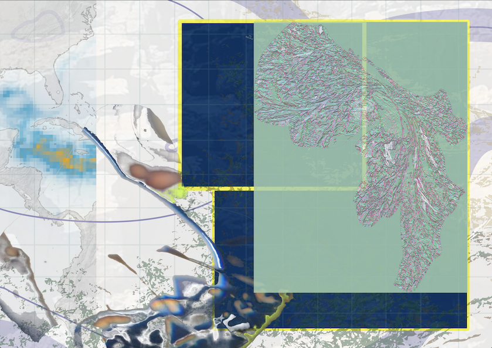

Holding Sway is a 'series of photo essays channels a visual curiosity about seaweeds with considerations of militarization, gender, Indigenous sovereignty, extractive regimes, and climate change.' Invited by Foundry journal guest editors Melody Jue and Maya Weeks, I wrote an essay and created five accompanying illustrated collages that consider seaweeds through elementality and politics. Inspired by computer simulated satellite imagery of the Great Atlantic Sargassum Belt, I write and visualise how ecologies, people, materials traverse waters across so-called borders, all the while sustaining culture and life."

--- 

""Holding Sway: Seaweeds and the Politics of Form” is a series of photo essays that channels a visual curiosity about seaweeds with considerations of militarization, gender, Indigenous sovereignty, extractive regimes, and climate change. We invited participants to create or curate images that literally and figuratively “hold sway” in two senses: capturing the attention of an audience, or conveying a relationship of being in touch with seaweeds by holding their swaying botanical forms. The contributors to this collection have also been swayed by the seaweeds themselves through modes of writing that reflect drifts in attention at field sites, or finding solidarity with seaweeds against extractive or colonial regimes. In other moments, the photo essays exhibit a desire to sway you, the reader, to become curious and haptically dwell with the unctuous forms of seaweeds as they open toward more kelp-like ways of being in touch with coastal environments. 

Throughout the photo essays that follow, seaweeds become a means of attuning to the specificities of place. Across a global range of geographies (or better, hydrographies), our contributors tend to seaweeds in the Eyak ancestral homeland in Prince William Sound, the Hawaiian island of Maui, the Sargasso Sea, the Scottish Hebrides, Japan, the United Kingdom, and Sweden. Each contributor articulates a specific relationship with the place from which they write. In turn, these relationships afford us—as readers, as editors—the ability to feel across states, fragments and fragmentation, refusals of colonial gazes, flatness and form, centuries of women’s labor, temporality, social reproduction, and tactility that encourages sensory awareness of our bodies as we read and gaze at the images. Yet seaweeds themselves are also of place. Seaweeds are morphologically plastic, growing into forms that best suit the conditions of the immediate environment. For example, calmer deep water, or shallower water beset by the ceaseless crashing of waves. Outside of the ocean, seaweeds are still shape-shifters: we find their extracts used in microbiology, in the historical manufacturing of gunpowder, in the stabilization of beer foam, in beauty products, and many other uses. The seven photo essays in this collection explore seaweeds and form in an expansive sense to include physical forms, life forms, political forms, cultural forms, and artistic media. 

---

'Another key theme is the connection between elementality and politics. Angela YT Chan’s essay, 'States of Hydration,' plays with two senses of state — both the political sense of states, and a more elemental sense of states of matter. These two senses of state come together in her digital collages, which feature both the fragments of satellite maps and almost liquidy impressions of seaweed bodies that seem to bleed through, much like Sam Nightingale’s contact prints in 'Para-photo-mancy.' Chan brings together the satellite aesthetic of geopolitical surveillance, tracking patches of sargassum that flow between nation states, alongside the way seaweeds can dry and rehydrate in (for example) a nourishing seaweed broth in Cantonese cuisine."

Read my illustrated essay [here](https://uchri.org/?post_type=foundry&p=24869&preview=true) and find out more about [here](https://uchri.org/foundry/holding-sway-seaweeds-and-the-politics-of-form/)

This photo essay is part of the Holding Sway: Seaweeds and the Politics of Form series, funded by UCHRI’s Recasting the Humanities: Foundry Guest Editorship grant.

