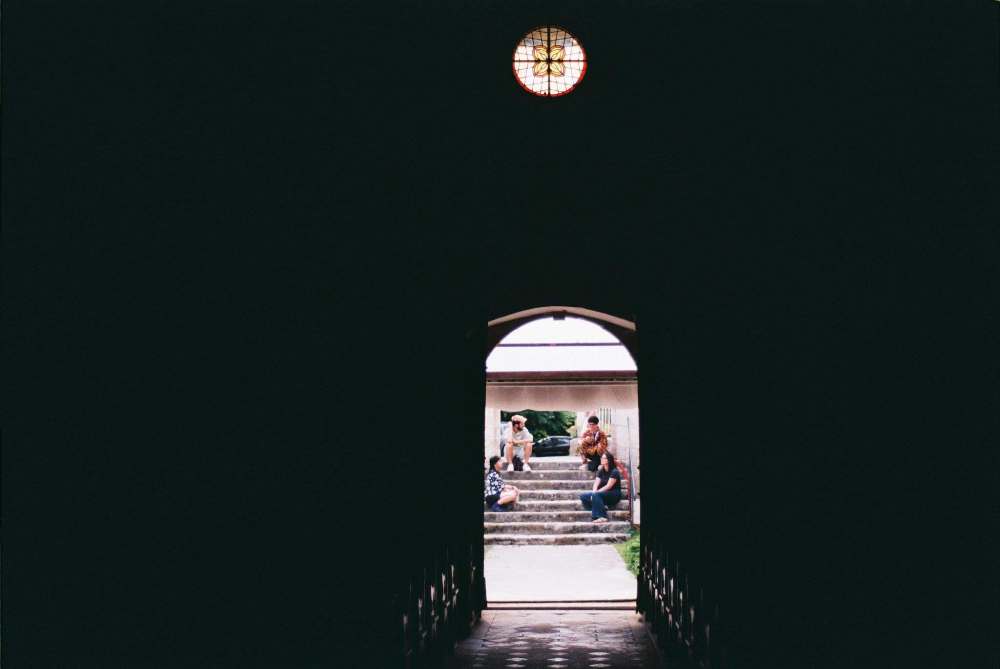
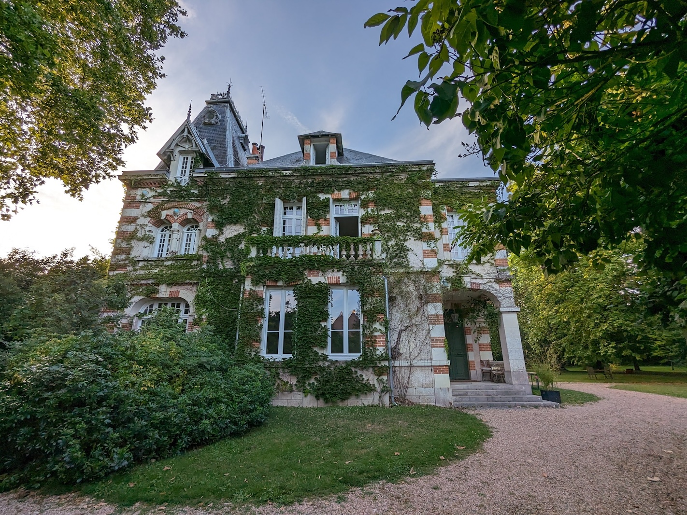

(July 10, 2023 → July 23, 2023) I was selected for the Artagon Artist Development Residency at Maison Artagon in Vitry-aux-Loges in France. I spent two weeks there with French artists and researchers, improving my French and using the dedicated time to research into the history of computing and the cloud. 

 Myself and Elise Poitevin by co-resident Mallaury Scala
 Residents by co-resident Mallaury Scala

27 residents (emerging artists, collectives, professionals and researchers), of 460 applications, were selected for the Summer 2023 season. My 2-week cohort consisted of myself and [Samy Lagrange](https://linktr.ee/samy.lagrange) (researcher, art critic and independent curator), [Sacha Rey](https://fragil.fr/) (film director, visual artist and video editor), [Mallaury Scala](https://www.p-o-l-e.com/mallaury) (choreographer, dancer and photographer) and [Elise Poitevin](https://sissi-club.com/a-propos-2/) (co-founder of the SISSI club and researcher).

"Artagon is a non-profit organisation founded in 2014, dedicated to the support,
promotion and guidance of emerging creation and cultures.

Throughout the year, it offers a wide range of programmes - exhibitions, events,
production support, grants, training, meetings, support, documentation, creation and
management of resource venues - aimed at art students, young artists and cultural
professionals at the beginning of their career.

Artagon now runs three venues dedicated to supporting emerging artistic and cultural
practices in France: Artagon Marseille, Artagon Pantin in the north-east of Paris, and
Maison Artagon in Loiret.

Based on the vision that art and culture play a key role in the development of an
innovative, more inclusive and caring society, and that emerging creation contributes to
reinventing and enchanting the world, Artagon leads and provides guidances to projects
in collaboration with numerous public and private actors, particularly in the economic,
social and educational fields"

Find out more [here](https://www.artagon.org/lieux/maison-artagon/)

