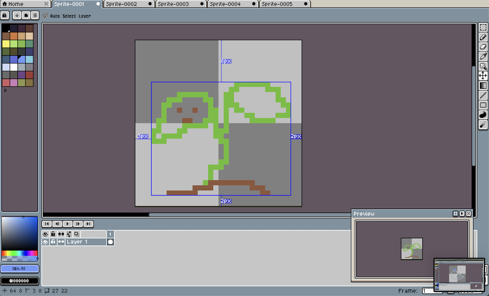
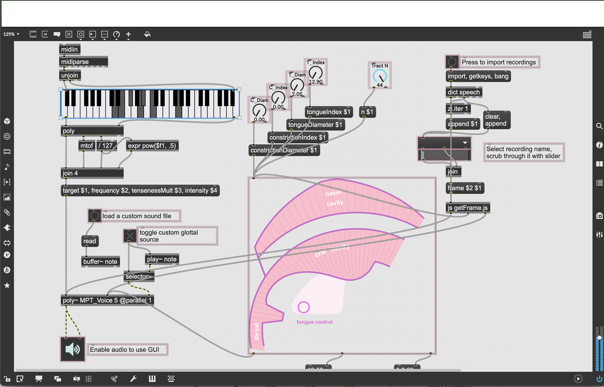
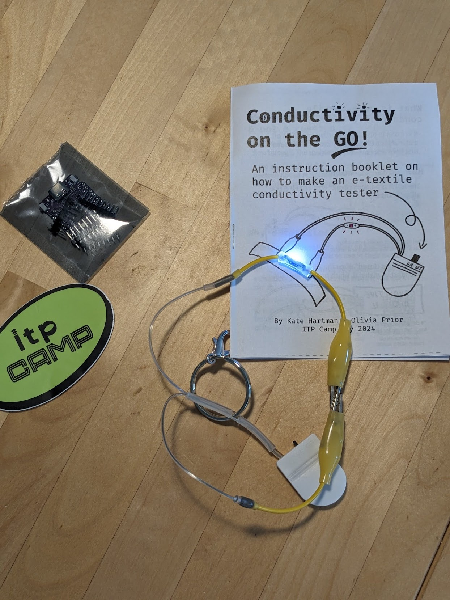
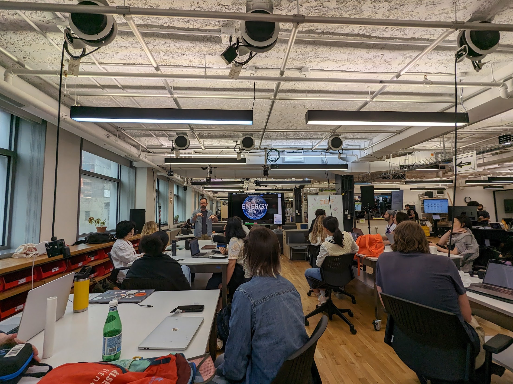
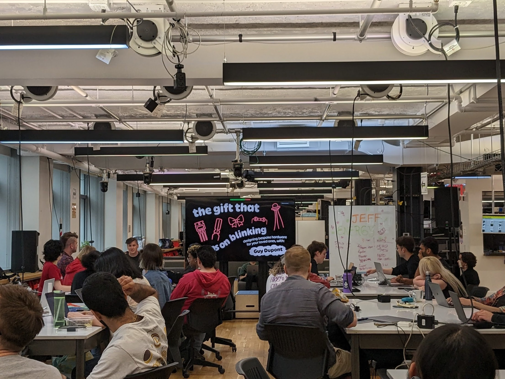
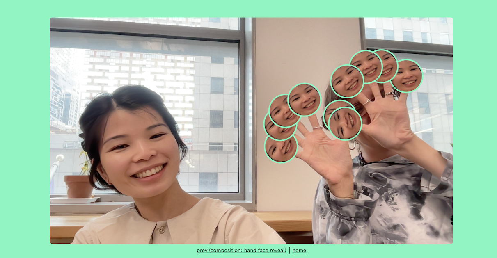

(June 3, 2024 → June 27, 2024) I joined ITP Camp for June 2024! Not quite a residency but a long period of peer learning based at the  ITP/IMA programme facilities at the NYU Jay Street campus. After moving away from 7 months working as a data engineer, I was happy to be in a creative space experimenting with different technologies, playing with a mix of soft- and hardwares with intro sessions to media forms across audio, visual and tactile, like e-textiles. Each day was marked with faculty and peer-led workshops, often giving tasters into a digtial tool or method, which Campers used towards general learning or a project. Towards the end of the month I spent some extra time on digital embroidery and showed my small piece at the [Show ALL Things Show](https://itp.nyu.edu/camp/2024/session/9). 

--- 

"ITP Camp is a crash course and playground for creative and techy people who want to shake things up. Every June in New York City, we invite makers, artists, musicians, programmers, fabricators, and creatives of all sorts to join the ITP community to make stuff, hear speakers on the cutting edge, and collaborate with people from diverse disciplines.

Camp sessions, activities, and events run in the afternoons, evenings, and weekends throughout the month of June, NYC-time. Some people take the month off and immerse themselves fully in the culture and experience of ITP Camp, while others freelance or work part-time while attending sessions in between or remotely. Many participants maintain day jobs outside of ITP Camp and join us for the evening activities.

ITP was founded with the belief that making is as fundamental to thinking. Like any summer camp, ITP Camp is playful, cooperative and collaborative but with a serious purpose. We seek those who are motivated to drive changes through creativity. We open our doors to anyone who’s yearning to create, innovate, find meaning, or simple long for a creative outlet.

The creative charge of ITP Camp comes from the community of participants sharing ideas, skills, criticisms, and passions with each other in small, informal groups. We build a flexible structure, an Un-University, that’s responsive and supportive to the group we select. The structure is based on “unconferences" such as foocamp or barcamp, where presentations and discussions form in response to each participants’ interests and projects."

Find out more [here](https://itp.nyu.edu/camp/2024/about)