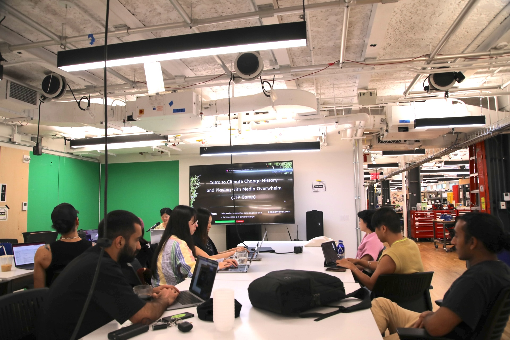
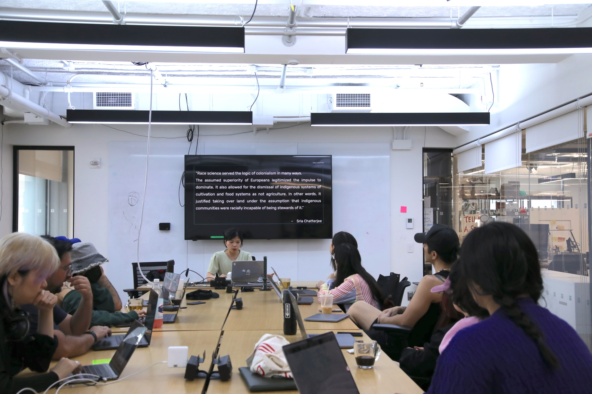

I gave an artist talk at ITP Camp to fellow campers that introduced the history of climate change. Through some project examples, I described some digtial media methods I use in my own practice, as well as in collaborative projects like climate investigations and with the forestscapes project, which uses audio and visual media collaging with Supercollider and Sam Lavigne's [videogrep tool](https://lav.io/notes/videogrep-tutorial/). 

--- 

"ITP Camp is a crash course and playground for creative and techy people who want to shake things up. Every June in New York City, we invite makers, artists, musicians, programmers, fabricators, and creatives of all sorts to join the ITP community to make stuff, hear speakers on the cutting edge, and collaborate with people from diverse disciplines.

Camp sessions, activities, and events run in the afternoons, evenings, and weekends throughout the month of June, NYC-time. Some people take the month off and immerse themselves fully in the culture and experience of ITP Camp, while others freelance or work part-time while attending sessions in between or remotely. Many participants maintain day jobs outside of ITP Camp and join us for the evening activities.

ITP was founded with the belief that making is as fundamental to thinking. Like any summer camp, ITP Camp is playful, cooperative and collaborative but with a serious purpose. We seek those who are motivated to drive changes through creativity. We open our doors to anyone who’s yearning to create, innovate, find meaning, or simple long for a creative outlet.

The creative charge of ITP Camp comes from the community of participants sharing ideas, skills, criticisms, and passions with each other in small, informal groups. We build a flexible structure, an Un-University, that’s responsive and supportive to the group we select. The structure is based on “unconferences" such as foocamp or barcamp, where presentations and discussions form in response to each participants’ interests and projects."

Find out more [here](https://itp.nyu.edu/camp/2024/about)