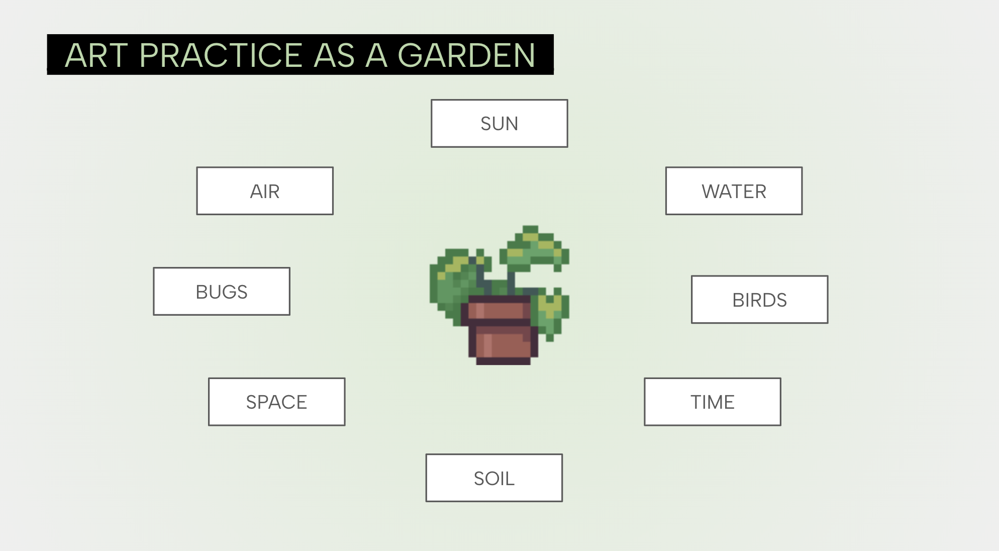

--- 
title: "Your Practice as a Garden: Lecture and Workshop on Professional Art Practice for BA Fine Art Undergraduates at University of Reading"

description: "I delivered a lecture to third year BA Fine Art students about developing a professional art practice, followed by a workshop to design their own artist-led workshops"
date: 2025-10-28
endDate: 2025-10-28
tags: ['teaching']
image: './251028_Reading.png'
---

I delivered a lecture to third year BA Fine Art students about developing a professional art practice, followed by a workshop to design their own artist-led workshops. 

Using a garden as a metaphor for art practice, I described the types of resources required for building a profession in the arts sector as a freelance artist. Overall, these metaphors highlighted the balance and pace of projects, the ways to continue self-learning and creative motivation, and the peer and mentor support that it often takes to navigate the early years of professional art practice. With each 'element' of the ecology of the garden/art practice, I offered examples from my own portfolio to illustrate the real scenarios of work, and gave exercise prompts for the students to reflect on their own interests, ambitions and situations. 

In the workshop I facilitated, students designed their own workshops. They considered all areas of research and activity design, as well as participant and self preparation, that are necessary for an artist's live workshop delivery - from working at selected publics at community level to open events at major cultural institutions. 

Find out more about BA Fine Art at [University of Reading](https://www.reading.ac.uk/ready-to-study/study/subject-area/art-ug/ba-art).  