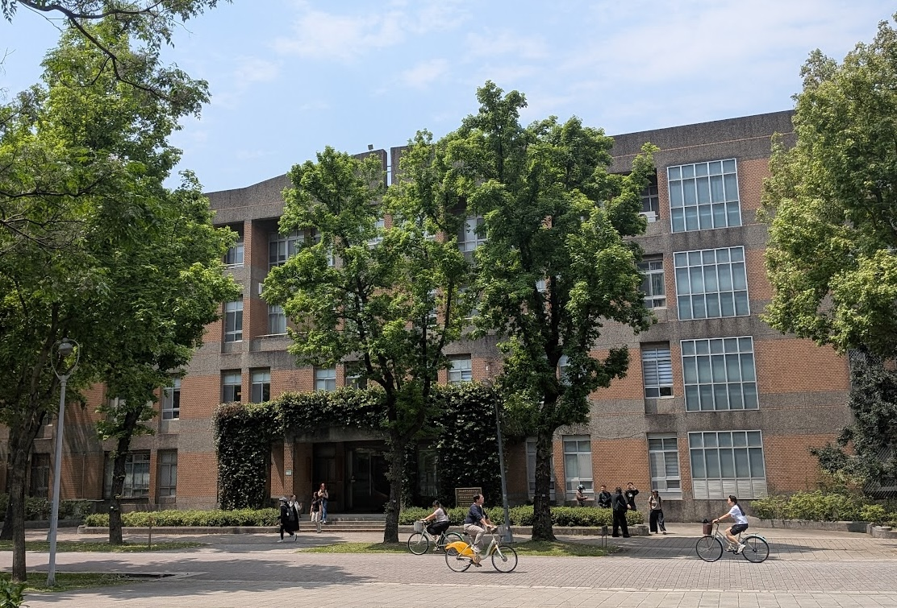
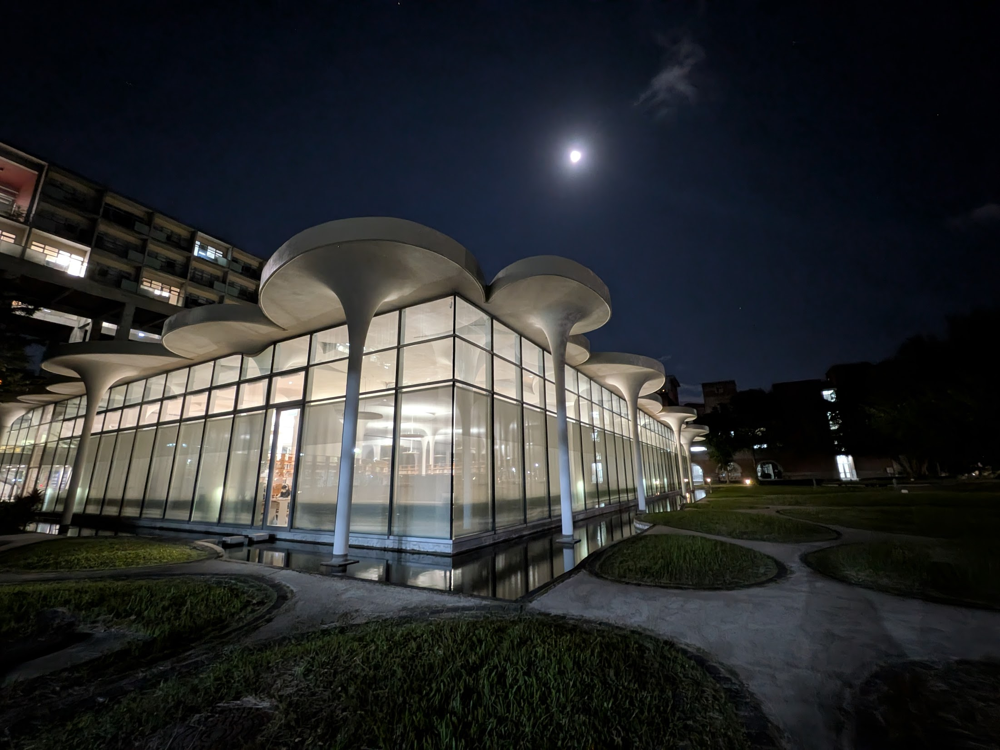
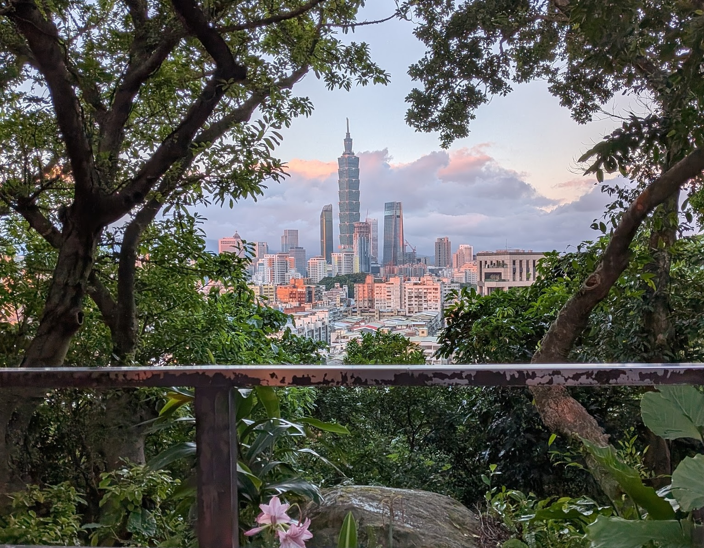
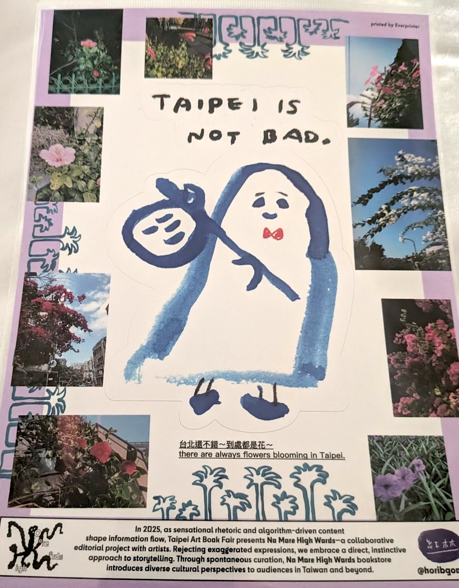

--- 
title: "6 Months at the Chinese Language Division, National Taiwan University"

description: "As a Huayu Enrichment Scholarship recipient, I studied an intensive Mandarin programme at the Chinese Language Division, National Taiwan University"
date: 2026-05-31
endDate: 2026-05-31
tags: ['award']
image: './260531_HES_NTU.jpg'
---

Between November 2025 to May 2026, I relocated to Taipei, Taiwan, to attend an intermediate level intensive Mandarin course at 國立臺灣大學語文中心中國語文組
the Chinese Language Division, National Taiwan University. 

This is the first time I've taken Mandarin lessons (I took Cantonese A Level as a teen), and it's a huge achievement to me to already feel much more confident in expressing myself during specialised debates using Mandarin. My daily lessons covered reading, writing, listening, with an emphasis on speaking during class hours. Since my course wrapped up a week ago, it feels surreal to not be doing intensive vocabulary dictation tests and essay writing everyday. I'm currently at B2 level (able to handle most professional communications) and had a chance to informally translate for my researcher friends, who visited Taipei recently to connect with artists and activists running third spaces in the sinosphere. 

The last half year has allowed me to become more familiar with the wider island's history, peoples and cultures. I've visited the capital before on previous work trips: panelling at [RightsCon](https://angelaytchan.net/blog/2025/250227_rightscon/) and workshopping with [Green Screen Climate Justice & Digital Rights Coalition](https://angelaytchan.net/blog/2025/250225_rightscon/) in 2025, and for [independent artistic research](https://angelaytchan.net/blog/2019/191015_dycp/) through my Arts Council England DYCP Award in 2019. 

But having this extended time to live in Taipei granted me the pace to get to know the city's amazing activist / third spaces and artistic activities, as well as the complexities that make up the island's diversity and current socio-political landscape. I've met a lot of new friends and collaborators, both local and of the diaspora, and I'm sure there's a lot more to come...  

The Chinese Language Division, National Taiwan University

National Taiwan University's Koo Chen-Fu Memorial Library, my second home while working remotely on [SOUNDSCALE](https://angelaytchan.net/blog/2025/250714_soundscale/)

Taipei at sunset 

A sticker poster gift from a friend on our visit to Taipei Artbook Fair

