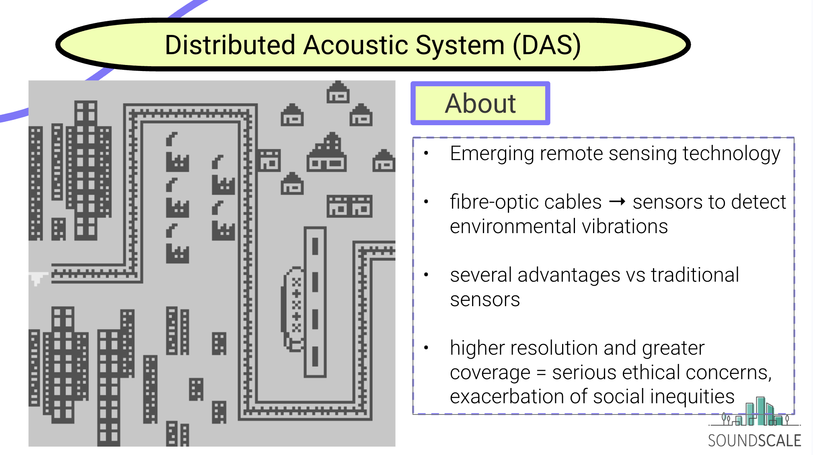
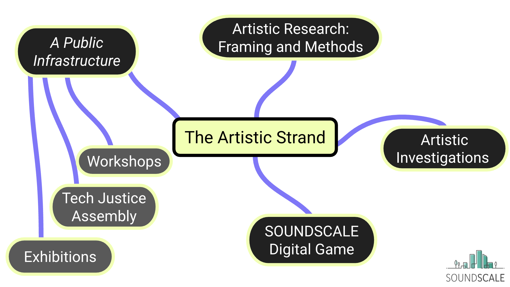
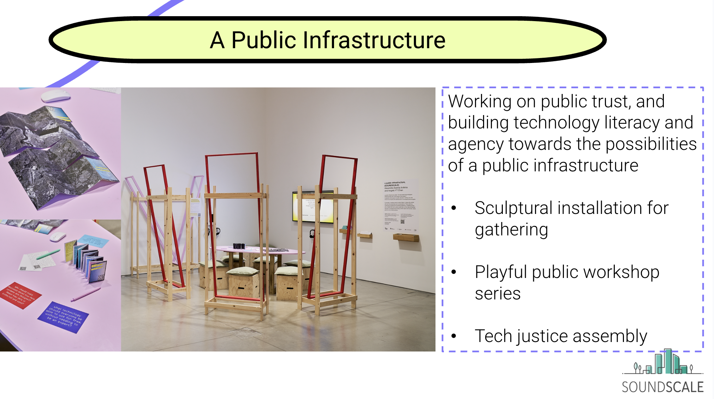
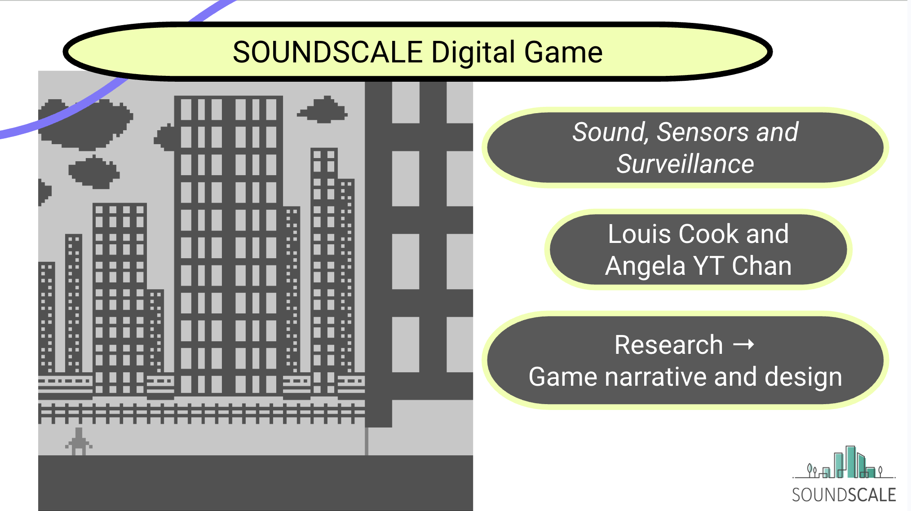
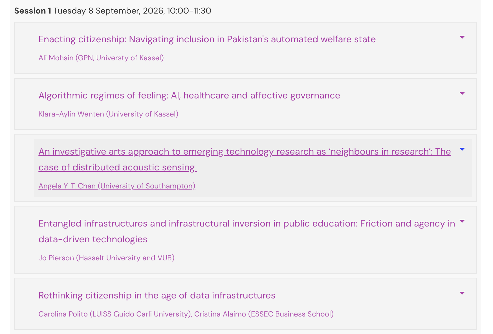
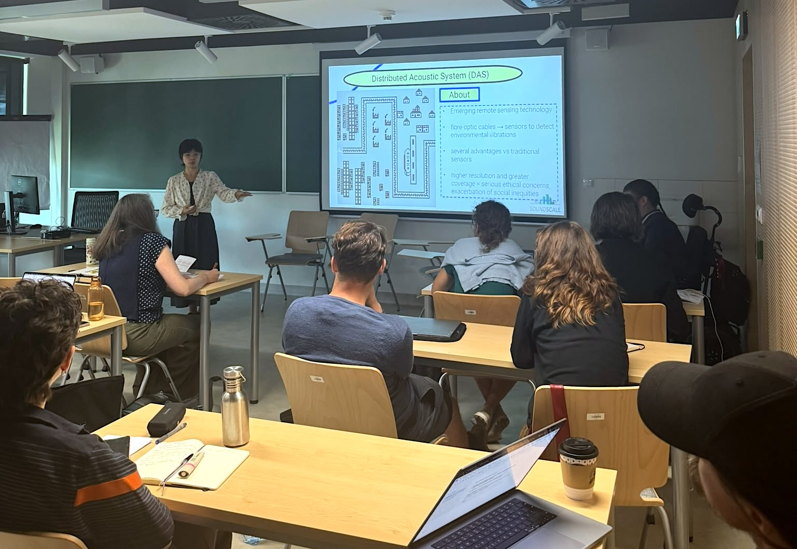
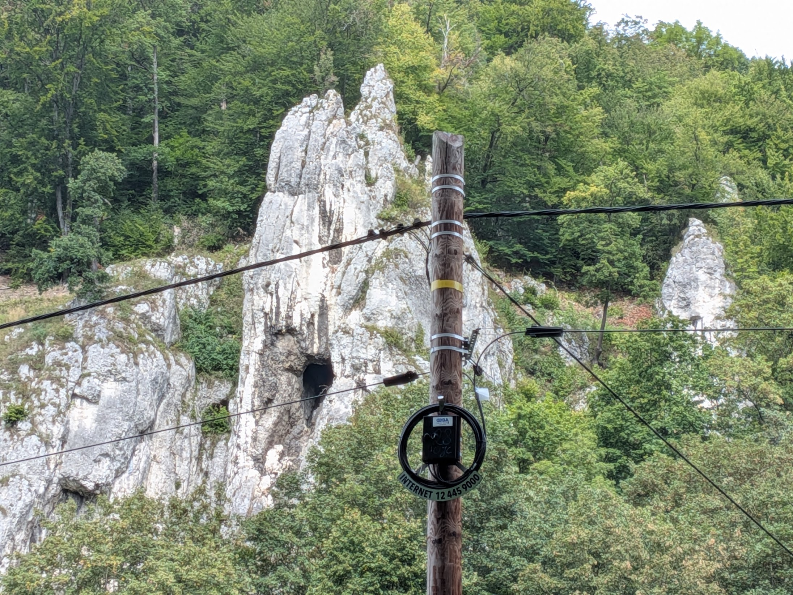
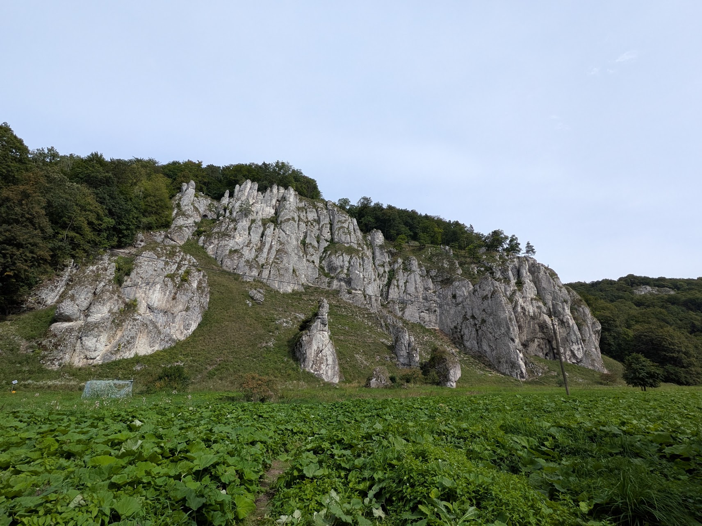
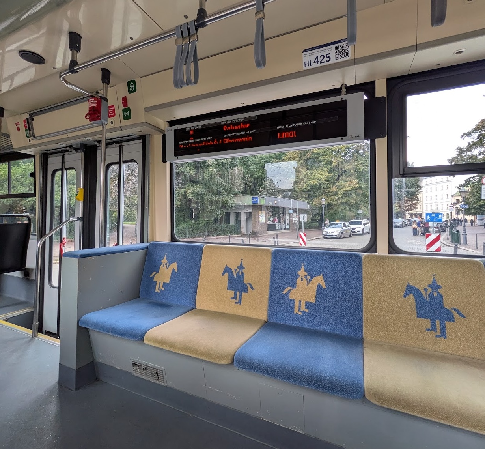
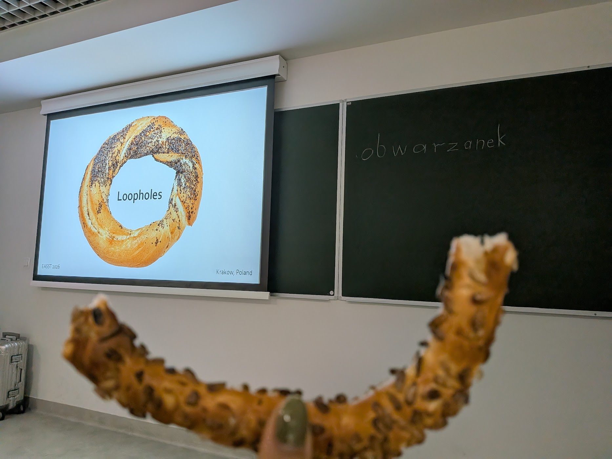

--- 
title: "Paper presentation for the 'Infrastructures of governance: Power and assemblages in the data-driven state' panel at EASST 2026 Conference, Krakow"

description: "I presented my accepted paper at EASST2026 this year, which was hosted in Krakow, Poland. I spoke in the Tuesday 8 September, 10:00-11:30 panel 'Infrastructures of governance: Power and assemblages in the data-driven state' convened by Jonas Breuer (University of Amsterdam) who chaired alongside Carina R. Nasser (University of Amsterdam), both of the DATAGOV project at the University of Amsterdam."
date: 2026-09-07
endDate: 2026-09-11
tags: ['conference / symposium']
image: './260904_poster.jpg'
---

I presented at EASST2026 this year, which was hosted in Krakow, Poland, and spoke in the panel, 'Infrastructures of governance: Power and assemblages in the data-driven state' convened by Jonas Breuer (University of Amsterdam) who chaired alongside Carina R. Nasser (University of Amsterdam), both of the [DATAGOV](https://datagovlab.net/) project at the University of Amsterdam.

My presentation was titled ‘An Investigative Arts approach to emerging technology research as neighbours in research: the case of distributed acoustic sensing (DAS)’. I shared an overview of my work as the Research Fellow on artistic research of [SOUNDSCALE](soundscale.ac.uk), an interdisciplinary UKRI-funded research project at the University of Southampton that explores a vibration-sensing emerging technology, distributed acoustic sensing. The project questions DAS' potential urban use cases using the fibre optic infrastructure, such as surveillance, consent and data privacy, and I introduced my methods and approaches for co-leading the artistic research strand.  

For this iteration of the presentation, which builds on my [Data Justice Conference](https://angelaytchan.net/blog/2026/260601_djc/) contribution earlier in June 2026, I added further two subproject details: the digital narrative Bitsy game project I co-produced with Louis Cook as part of my research activities, as well as the 'a public infrastructure' public workshop programme that ran at John Hansard Gallery, Southampton between June-September 2026.

"This panel explores how data infrastructures govern the polity by automating information, inviting work on assemblage thinking, infrastructural inversion, and participatory approaches to studying citizenship, sovereignty, and inequality.

Digital infrastructures increasingly govern society by automating the production, circulation, and interpretation of information. From biometric identification to digital identity systems and health technologies, such regulatory data infrastructures shape how citizenship, sovereignty, and inequality are exercised and experienced. They translate governance into code, and in doing so, redefine relations between states, markets, and citizens. What happens to the state, when regulatory functions are increasingly taken up by private-owned infrastructures? How is this power-shift shaping the future of liberal democracies?

This panel invites contributions that explore these transformations through the lens of Science and Technology Studies and neighbouring disciplines, foregrounding infrastructures as socio-technical assemblages and sites of power. In resonance with the EASST 2026 theme “More-than-now”, the panel looks beyond immediate technological debates to examine how data infrastructures prefigure possible futures of democracy and governance. We invite interventions that address the dynamics, politics, affects and methods of studying governance by data infrastructure—including assemblage thinking, infrastructural inversion, and participatory approaches to complex research ecologies."

Read more about this year's programme[here](https://easst.net/conference/easst2026/easst2026-programme/#timetable)

Some other things I enjoyed along the way... 

 Ojcowski National Park
 Krakow tram
 Obwarzanek witnessed and eaten at the 'Loopholes' panel convened by David Moats (Kings College London) and Malte Ziewitz (Cornell University) "Loopholes are an integral but understudied part of techno-scientific systems. How can we develop concepts, theories, and methodologies in STS by studying loopholes across a range of practices and fieldsites?"
 niche joke
