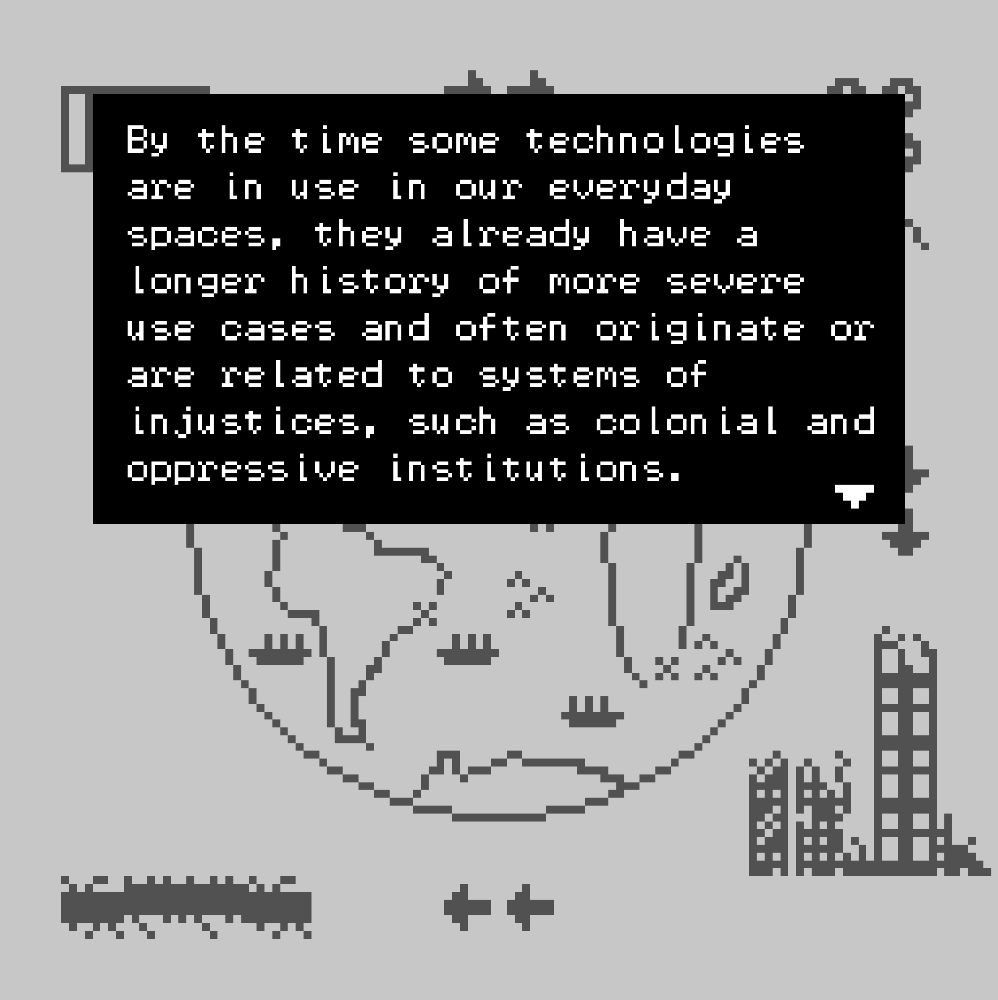
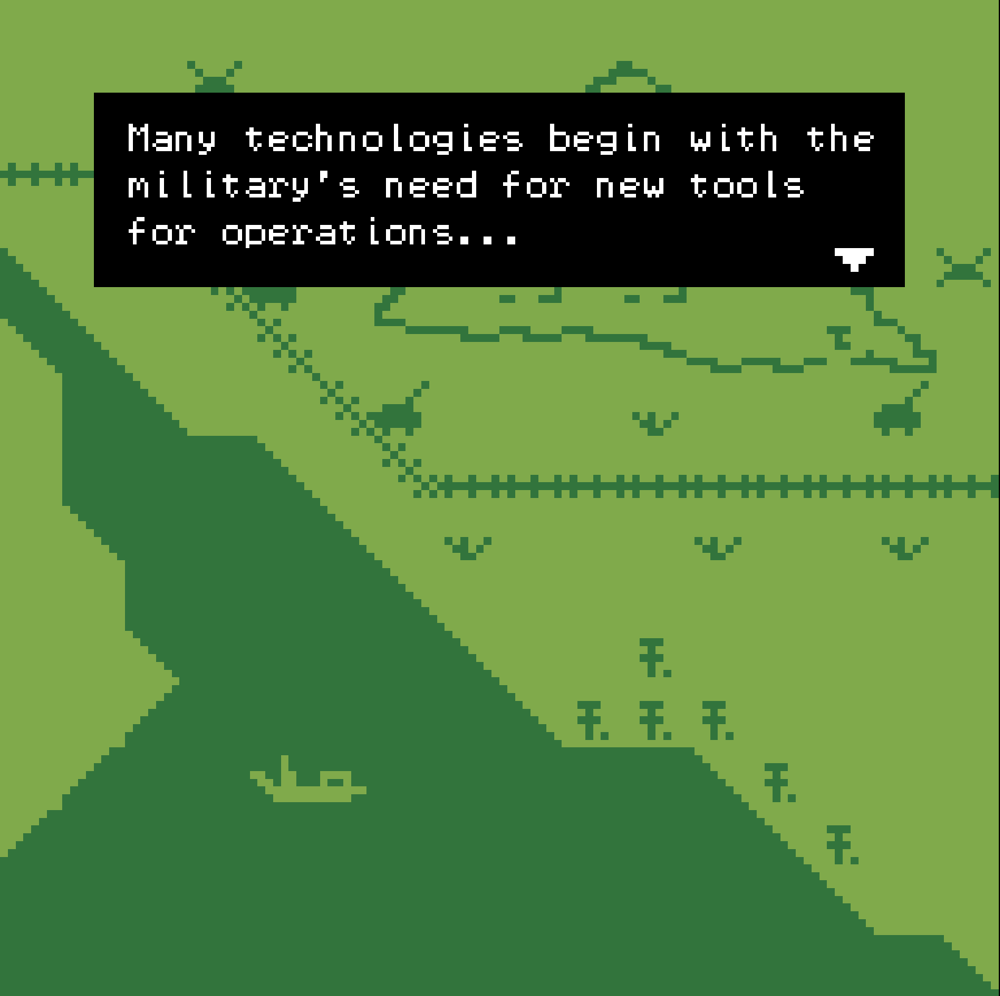
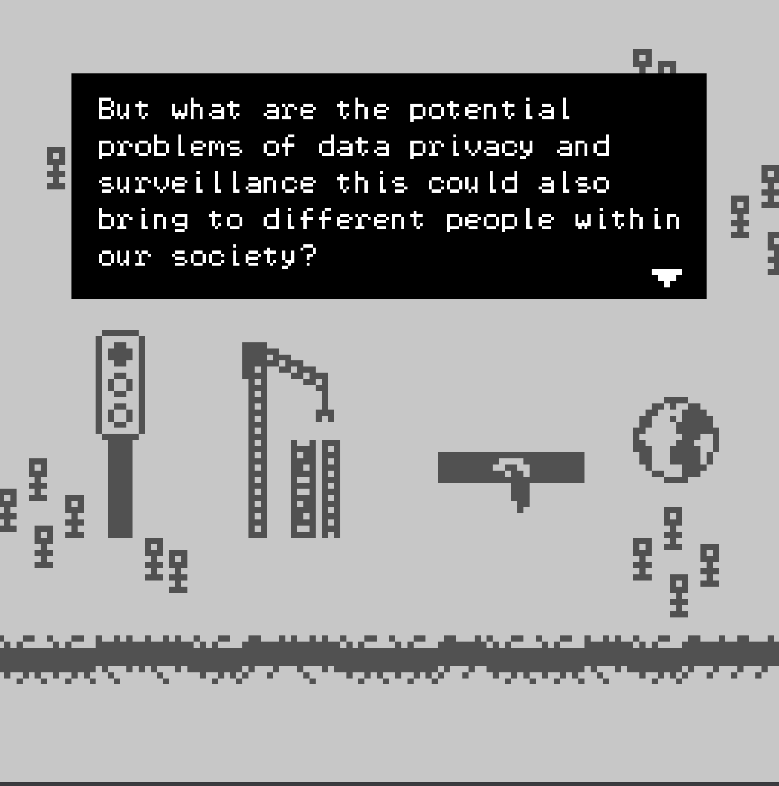
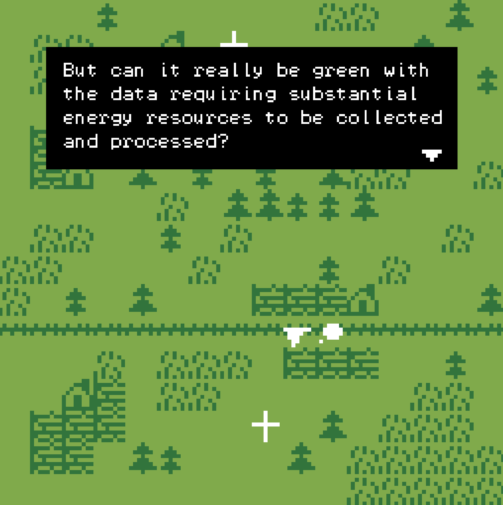
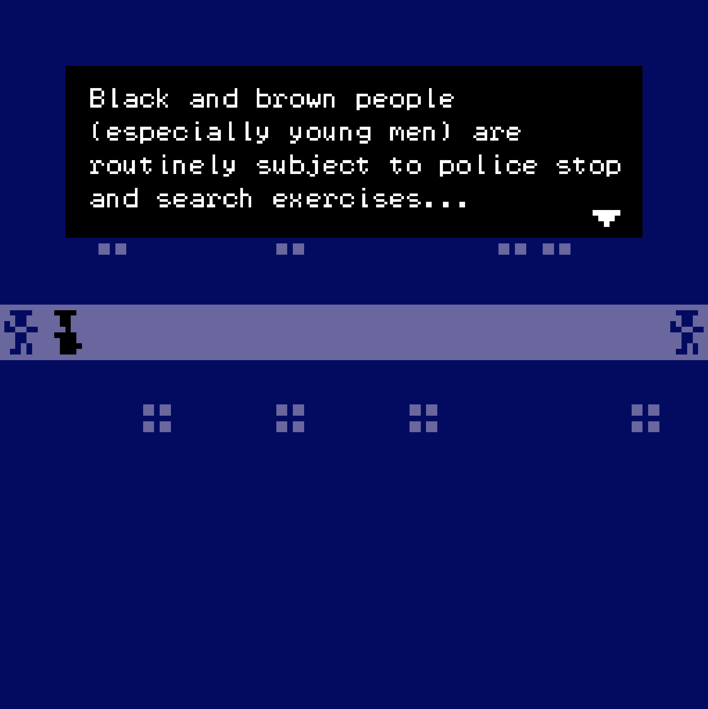
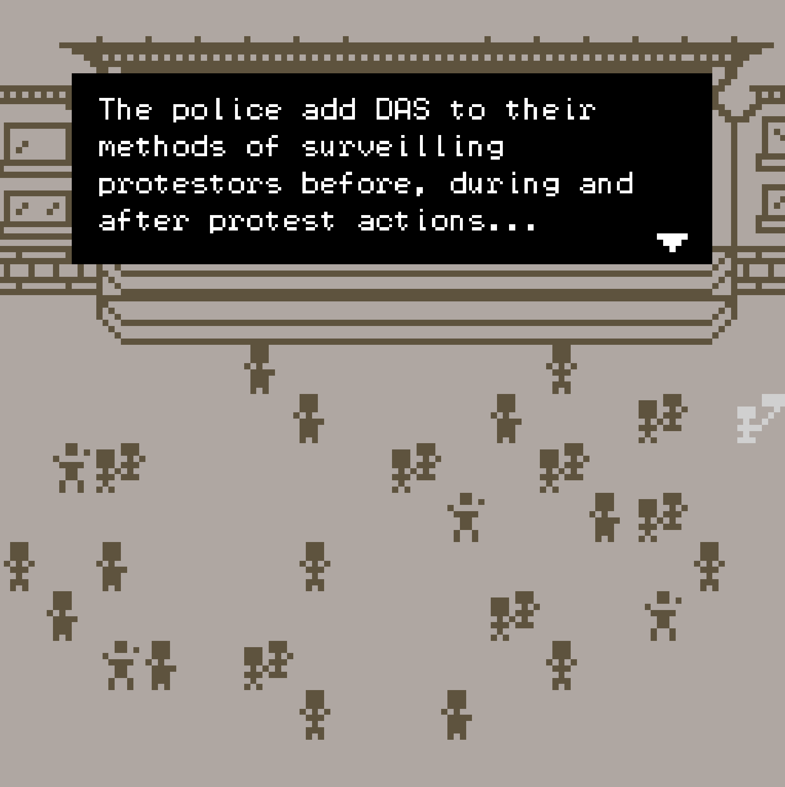
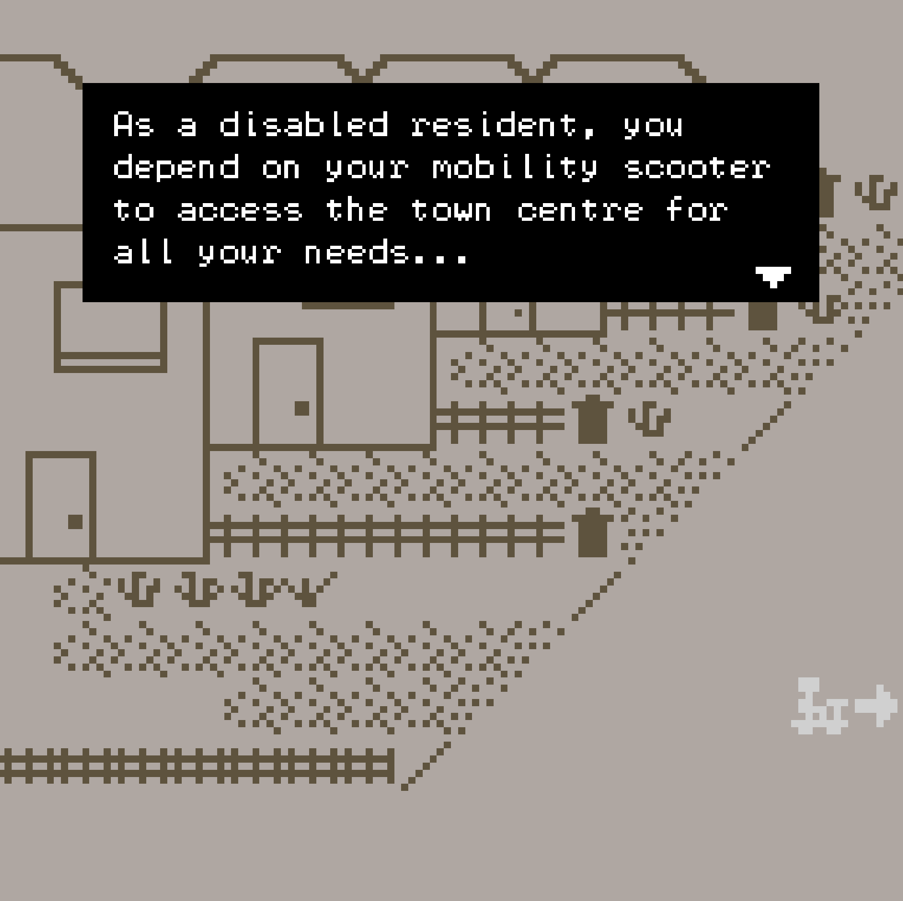

--- 
title: "'Sound, Sensors and Surveillance' a Bitsy game by Angela YT Chan and Louis Cook"

description: "This is a digital narrative game about the surveillance state and its use of emerging technologies. Specifically, how might they be used to disproportionately monitor marginalised communities in our neighbourhoods and worsen existing social injustices?"
date: 2026-09-22
endDate: 2026-09-22
tags: ['games','artwork','collaboration']
image: './260922_SSSLaunch_cover.png'
---

Sound, Sensors and Surveillance 
A game by Angela YT Chan (narrative and game design) and Louis Cook (game design, build, and sound). 

'Sound, Sensors and Surveillance' is a digital narrative game about the surveillance state and its use of emerging technologies. Specifically, how might they be used to disproportionately monitor marginalised communities in our neighbourhoods and worsen existing social injustices?  

Surveillance in public spaces is known to be discriminatory and limits the freedoms and dignity of certain groups. This includes carrying out predictive policing: assuming some are more likely to commit crimes based on discriminatory stereotypes.  

Built with Bitsy by game designer and composer Louis Cook and artist-researcher Angela YT Chan, the game brings together social justice, critical technology research and low-tech, digital narrative game building to reframe emerging technologies in the context of human rights. 'Sound, Sensors and Surveillance' aims to be a playful and inclusive approach to empower more community conversations and resilience against how technology is often deployed without transparency or full consent, least not by the most marginalised groups of society.   

Sound, Sensors and Surveillance was created as part of the UKRI-funded SOUNDSCALE project.  
- Play the game on [itch.io](https://louiscookmusic.itch.io/sound-sensors-and-surveillance)
- Read the textual accompaniment [‘‘Sound, Sensors and Surveillance’: a critical video game on emerging technology’](https://tr.ee/OFFK2SWG_9) 
- Read the [narrative transcript](https://tr.ee/jzzLuKAOV3)
- Follow the public events [here](https://linktr.ee/louis_angela_soundscale)

