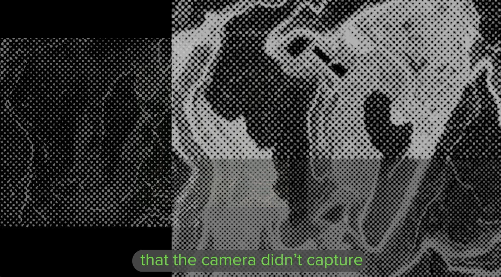
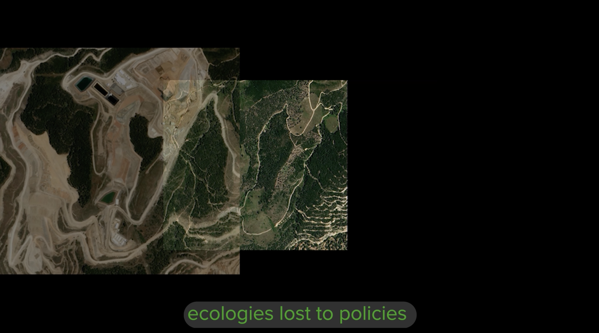
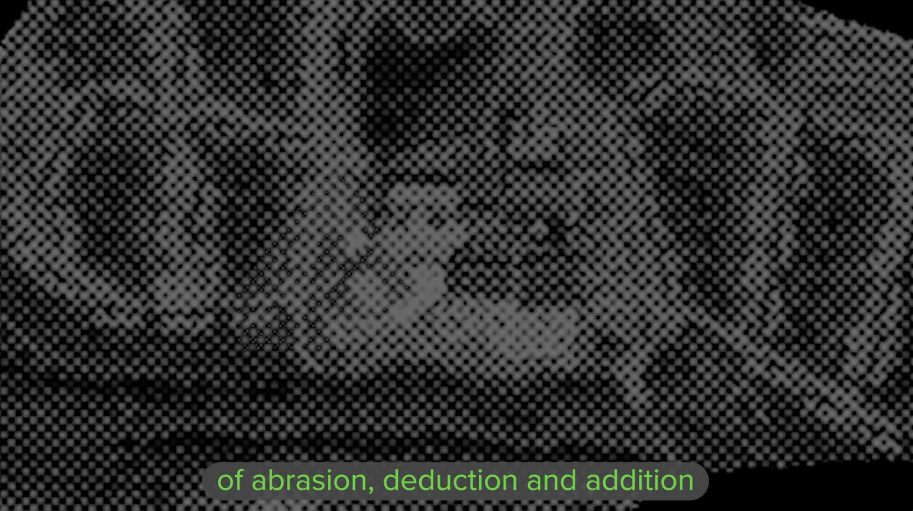
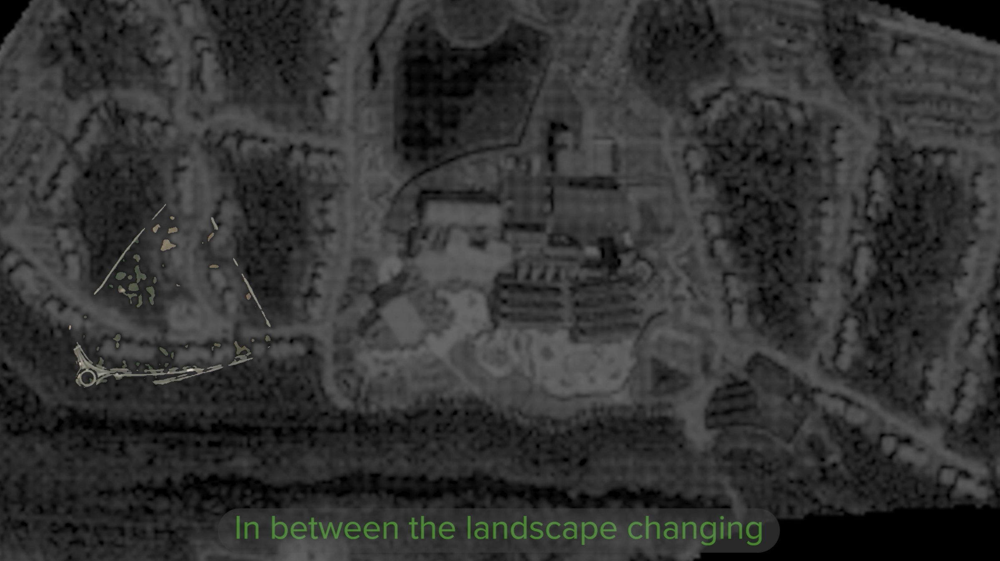

--- 
title: "'In Between Green and Grey' (2026), new video artwork commissioned by Arena for Journalism Europe, premieres at University of Cambridge"

description: "'In Between Green and Grey'(2026) my new video artwork commissioned by Arena for Journalism in Europe. It will premiere at the 25th Anniversary Exhibition, 'Knowledge in a Fractured World', for the Centre for Research in the Arts, Social Sciences and Humanities (CRASSH) at the University of Cambridge."
date: 2026-10-05
endDate: 2026-12-11
tags: ['artwork', 'exhibited in']
image: './ibgtg2.png'
---

'In Between Green and Grey'(2026) my new video artwork commissioned by Arena for Journalism in Europe. It will premiere at the 25th Anniversary Exhibition, 'Knowledge in a Fractured World', for the Centre for Research in the Arts, Social Sciences and Humanities (CRASSH) at the University of Cambridge. 

In Between Green to Grey (2026) is the artistic accompaniment to Green to Grey (2025) "a cross-border, collaborative data project about Europe's disappearing nature,” initiated by Arena for Journalism in Europe and the Norwegian public broadcaster NRK. 

The investigation used the satellite images of nature loss from across 52 cases of ecological destruction. These were originally gathered using a custom AI model to achieve new and more precise visual evidence on the true scale of ecological destruction in Europe between 2018 and 2023. The images shaped investigations by journalists from 11 European newsrooms about their country’s ecological loss for Green to Grey. 

This video artwork was created using these images through the processes of thermal printing, scanning, collaging and digital animation. These perform a speculative visual narrative that fill the gap between the ‘before and after’ evidence snapshots captured by the satellite images. The animation ponders on the policy, industrial and construction processes uncovered by the journalists that have turned these landscapes from green to grey. 

To read the investigations, visit greentogrey.eu

--- 

"Marking twenty‑five years of interdisciplinary research and public engagement, this special anniversary exhibition reflects on how collaboration and knowledge‑making operate across and beyond the academic community.

Under the anniversary theme Knowledge in a Fractured World, the exhibition forms part of a wider programme exploring how knowledge is produced, contested, and translated into action amid political polarisation, technological disruption, environmental crisis, and shifting global power relations. Bringing together scholars, artists, activists, and practitioners, we ask what happens to knowledge in such conditions, and how it may serve either to entrench divisions or to imagine more just futures and enable new forms of solidarity and action.

The exhibition showcases examples of interdisciplinary research from across CRASSH alongside an eclectic mix of works by international artists responding to the theme, with contributions ranging from global challenges to intimate personal narratives."

Read more about the exhibition, 'Knowledge in a Fractured World', [here](https://www.crassh.cam.ac.uk/events/52515/). It is open weekdays from 09:00 - 19:00 between 5 Oct 2026 - 11 Dec 2026 at the Alison Richard Building, 7 West Road, Cambridge CB3 9DP. 
